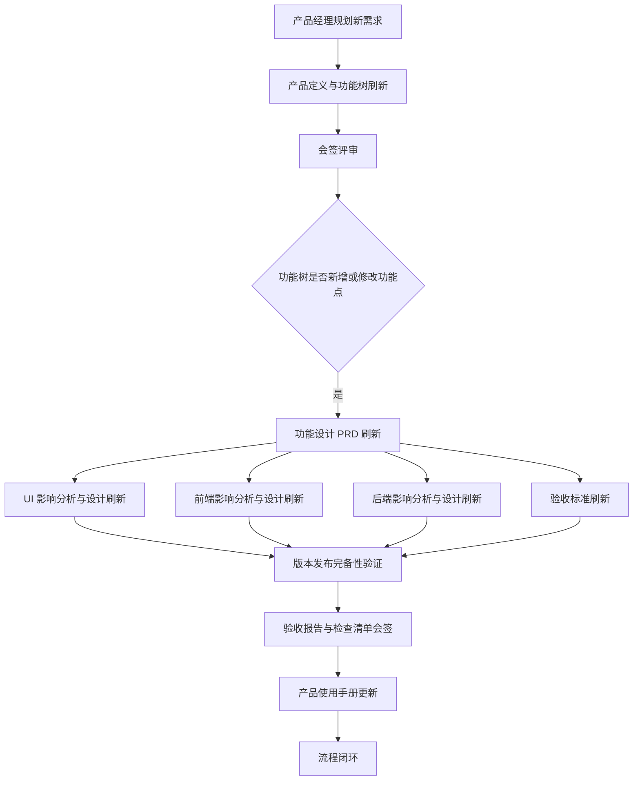

# 产品开发流程

本文档说明本项目的产品开发主流程。所有涉及跨文档更新的工程任务，必须先加载并严格遵循 `docs/.playbooks/` 下对应的标准操作剧本；本文仅描述流程顺序、触发条件、产出物与迭代边界，不替代具体剧本。

## 一、流程总览

产品开发以“新需求规划”为起点，以“版本验收完成并上线”为主要设计迭代边界，以“产品使用手册完成更新”为闭环终点。

## 二、标准流程

| 步骤 | 触发条件 | 必须遵循的剧本 | 主要产出 | 迭代边界 |
| --- | --- | --- | --- | --- |
| 1. 产品定义刷新 | 产品经理规划新需求 | `docs/.playbooks/write-product-definition.md` | 产品定义文档刷新、功能树刷新、会签评审结论 | 会签评审通过后进入功能设计 |
| 2. 功能 PRD 刷新 | 功能树新增功能点，或历史功能点需要修改 | `docs/.playbooks/write-function-prd.md` | 对应功能设计文档的 PRD 部分刷新 | PRD 可随设计、评审、验证持续迭代，直至版本验收完成并上线 |
| 3. UI 设计刷新 | 功能设计 PRD 更新 | `docs/.playbooks/write-function-UI.md` | UI 是否需要刷新的分析结论；如需要，刷新 UI 设计内容 | UI 设计可随 PRD 和评审反馈迭代，直至版本验收完成并上线 |
| 4. 前端设计刷新 | 功能设计 PRD 更新 | `docs/.playbooks/write-function-frontend.md` | 前端是否需要刷新的分析结论；如需要，刷新前端设计内容 | 前端设计可随 PRD、UI、后端约束和验证反馈迭代，直至版本验收完成并上线 |
| 5. 后端设计刷新 | 功能设计 PRD 更新 | `docs/.playbooks/write-function-backend.md` | 后端是否需要刷新的分析结论；如需要，刷新后端设计内容 | 后端设计可随 PRD、前端联调和验证反馈迭代，直至版本验收完成并上线 |
| 6. 验收标准刷新 | 功能设计 PRD 更新，或专项设计发生变化 | `docs/.playbooks/write-function-validate.md` | 功能验收标准刷新 | 验收标准必须随 PRD、UI、前端、后端设计变化同步迭代，直至版本验收完成并上线 |
| 7. 版本发布验证 | 当前版本的功能设计、实现与验收资料准备完成 | `docs/.playbooks/check-release.md` | 版本发布完备性验证结论、验收报告、检查清单 | 验证未通过时回到对应设计或实现环节修正 |
| 8. 产品使用手册更新 | 版本验收报告和检查清单完成会签 | `docs/.playbooks/write-product-use.md` | 产品使用手册刷新 | 手册完成更新后，本轮产品开发流程闭环 |

## 三、阶段说明

### 1. 新需求规划与产品定义

产品经理提出或规划新需求后，应指定 agent 按照“产品定义”剧本执行。该阶段必须完成基于新需求的产品定义文档刷新、功能树刷新，并组织会签评审。

会签评审通过后，功能树作为后续功能设计工作的入口。未通过时，应继续回到产品定义与功能树内容进行修正。

### 2. 功能 PRD 设计

当功能树中出现新增功能点，或历史功能点需要修改时，应指定 agent 按照“功能设计 - PRD”剧本执行，对对应功能设计文档的 PRD 部分进行刷新。

PRD 是 UI、前端、后端与验收标准更新的共同依据。PRD 设计可以在评审、专项设计、实现反馈或验收反馈中持续迭代，直至版本验收完成并上线。

### 3. UI 设计

每次功能设计 PRD 更新后，应按照“功能设计 - UI”剧本分析 UI 是否需要刷新。

如果 UI 不受影响，应在设计文档中保留明确的不刷新结论；如果 UI 受影响，应刷新对应 UI 设计内容。UI 设计可以随 PRD 变化、评审反馈和验收反馈持续迭代，直至版本验收完成并上线。

### 4. 前端设计

每次功能设计 PRD 更新后，应按照“功能设计 - 前端”剧本分析前端是否需要刷新。

如果前端不受影响，应保留明确的不刷新结论；如果前端受影响，应刷新前端实现方案、交互逻辑、状态处理、接口依赖等相关设计内容。前端设计可以随 PRD、UI、后端接口和验收反馈持续迭代，直至版本验收完成并上线。

### 5. 后端设计

每次功能设计 PRD 更新后，应按照“功能设计 - 后端”剧本分析后端是否需要刷新。

如果后端不受影响，应保留明确的不刷新结论；如果后端受影响，应刷新后端接口、数据结构、业务规则、权限控制、任务流程等相关设计内容。后端设计可以随 PRD、前端联调和验收反馈持续迭代，直至版本验收完成并上线。

### 6. 验收标准

每次功能设计 PRD 更新后，应按照“功能设计 - 验收”剧本刷新验收标准。若 UI、前端或后端设计在后续迭代中发生变化，也应同步检查并更新验收标准。

验收标准必须能够覆盖 PRD 目标、关键用户路径、重要边界条件、异常场景和发布风险。验收标准可以随设计更新持续迭代，直至版本验收完成并上线。

### 7. 版本发布完备性验证

当版本内功能设计、实现、验收标准、测试资料和发布资料准备完成后，应按照“版本发布验证”剧本进行版本发布完备性验证。

验证通过后，形成或确认版本验收报告与部署检查清单；验证未通过时，应根据问题归属回到产品定义、功能设计、实现、验收标准或发布资料环节修正。

### 8. 产品使用手册更新

版本验收报告和检查清单完成会签后，应按照“产品使用手册撰写”剧本更新产品使用手册。

产品使用手册应面向用户视角反映本次版本上线后的真实功能、操作路径、注意事项和限制条件。手册更新完成后，本轮产品开发流程闭环。

## 四、执行原则

1. 剧本优先：触发具体任务时，必须加载并遵循对应剧本，不得用本文档替代剧本执行细节。
2. PRD 驱动：UI、前端、后端和验收标准均由功能设计 PRD 更新触发分析。
3. 影响先判定：专项设计更新前，必须先判断是否受 PRD 更新影响；不受影响也应留下明确结论。
4. 验收同步：验收标准必须随 PRD 和专项设计变化同步维护，避免设计与验收脱节。
5. 会签闭环：产品定义刷新、版本验收报告、部署检查清单等关键节点必须完成会签后再进入后续阶段。
6. 上线前可迭代：PRD、UI、前端、后端和验收标准在版本验收完成并上线前均可持续迭代。
7. 手册收尾：版本会签通过后，必须更新产品使用手册，确保用户文档与已上线能力一致。
