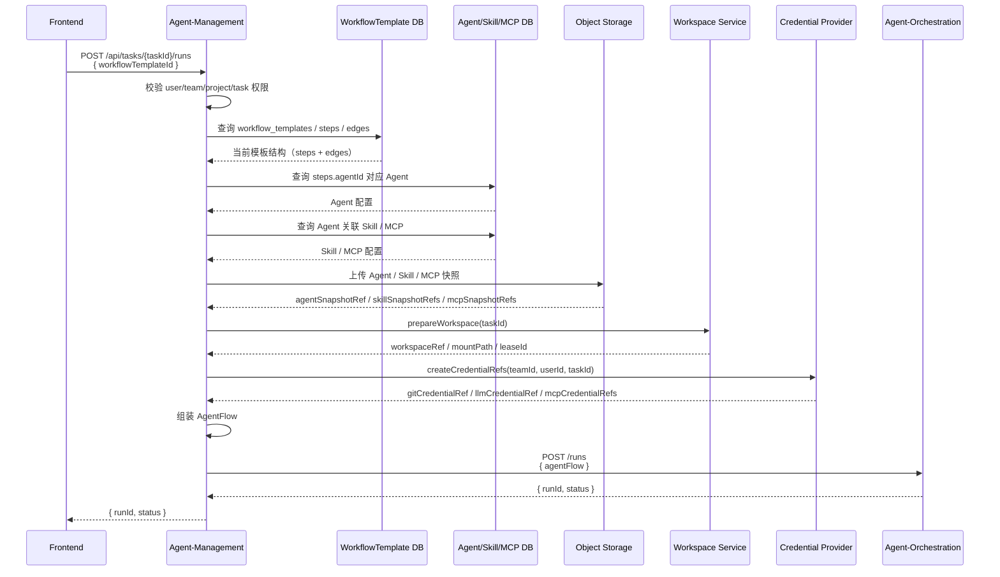

# Agent-Orchestration AgentFlow 与 Workflow 模板设计（草案）

> 文档定位：在 Coplat 云端化总体架构下，细化 Agent-Orchestration 与 Agent-Management、Workflow 模板、AgentFlow、Agent Core 之间的职责边界和数据模型。本文重点覆盖微服务边界、模板存储、AgentFlow 快照、模板到 AgentFlow 的转换，以及当前已确认的 MVP 约束；调度器状态机、运行库表结构后续另文展开。
>
> **MVP 范围（鉴权暂缓）**：经产品决策，MVP 阶段 Agent-Orchestration **不实现用户级鉴权**。下文所有关于「验 JWT、run 授权范围、浏览器凭 JWT 直连、401/403」的描述均为**后续目标**，MVP 暂不落地——只读接口（`GET /runs/{id}`、`GET /runs/{id}/events`）暂为无鉴权直连。这是临时简化、上线前必须补齐：当前任何人凭 runId 即可读取他人 run 的状态与实时事件流，安全风险需单独跟踪。
>
> **架构修订（单存储，2026-06）**：经决策改为**单存储**——run / step / attempt 状态与执行事件**只持久化在 Agent-Orchestration**（openGauss `workflow_event` 等表），**不再回流 Agent-Management**。下文所有关于「outbox 回流、异步回流 Agent-Management 落库、`POST /internal/agent-orchestration/events`、session/segment/event 为历史回放事实源、背压降采样」的描述**均已废弃**。取而代之：Agent-Management 经 `GET /runs/{id}` 主动查询 run 终态（查到结束即结束其业务侧工作流），历史展示事件经 `GET /runs/{id}/events/poll` 拉取；orchestration 自身即事实源。`outbox_message` 表、`OutboxService`/`OutboxWorker`、`AgentManagementClient` 已从代码移除。

## 0. 概要

本文定义 Coplat 云端化后 Agent-Orchestration 层与 Agent-Management、Agent Core、Workflow 模板、AgentFlow 之间的职责边界和 MVP 数据模型。

整体架构上，Agent-Management 是业务控制面，负责用户 / 团队权限、Workflow 模板、Agent / Skill / MCP 配置、workspace、credential refs 和 AgentFlow 组装；Agent-Orchestration 是工作流编排层，只执行 Agent-Management 提交的 AgentFlow，不读取 Agent-Management 业务表，不感知底层运行时；Agent Core 是运行时执行层，负责把 Agent-Orchestration 的 StepAttempt 落到实际执行环境，并回报 Agent 执行事件。

AgentFlow 是 Agent-Management 在启动 run 时生成的不可变执行快照，由当前 WorkflowTemplate、Agent / Skill / MCP 快照引用、task / project / workspace 上下文、repo 配置、credential refs 和 prompt variables 组成。Agent-Orchestration 持久化并执行 AgentFlow，不受后续模板或 Agent 配置变更影响——这一冻结即是运行隔离的保证，模板无需为此单独存版本。云端 workspace 初始为空卷，代码仓由 Agent Core 在 attempt 启动时 clone 进 workspace，Agent-Management 不预先 clone。

Workflow 模板属于 Agent-Management 数据库，包含 `workflow_templates`、`workflow_template_steps`、`workflow_template_edges` 三类表（不保留版本/快照表）。运行时 Agent-Management 把当前模板转换成 AgentFlow，再调用 Agent-Orchestration `POST /runs` 启动执行。

Agent-Orchestration 的执行语义包括：简单 prompt 变量替换、固定 DAG、MVP 串行 step 调度、StepOutput 结构化输出、`requiresConfirmation` 人工确认，以及 StepAttempt 执行尝试模型。AgentFlow 不包含底层运行时字段、资源规格、镜像、节点、容器、任务、进程、密钥等信息。

Agent Core 对 Agent-Orchestration 提供启动、取消、查询 StepAttempt 的能力，并上报控制类、展示类、运行时类事件。Agent-Orchestration 负责校验事件归属、推进 attempt 状态机：展示类事件经只读直连实时推给浏览器、并异步回流 Agent-Management 落库供历史回放。Agent Core 的性能要求强调低延迟、幂等、可查询、控制事件可靠；展示类事件可以限流，但不能阻塞 heartbeat、attempt.result、runtime.failed 等控制事件。

Agent-Orchestration 规划自身做用户级鉴权（验 JWT + run 启动时冻结的授权范围，**MVP 暂缓，见顶部范围说明**），浏览器的只读访问（查询状态、订阅实时事件流）可凭 JWT 直连，缩短链路；所有写操作（启动 / confirm / continue / cancel / retry）仍经 Agent-Management。

Agent-Orchestration 规划自身做用户级鉴权（**MVP 暂缓，见顶部范围说明**），对外提供 run 生命周期（启动 / 取消）、suspended step 操作（confirm 推进下游 / continue 带反馈续聊 / retry 重试）、查询与事件回调等 API（见第 9 章）。写操作经 Agent-Management（需组装 AgentFlow 并校验业务权限）；浏览器的只读访问（查询状态、订阅实时事件流）可直连 Agent-Orchestration，缩短链路。第 10 章给出端到端控制流与事件流，第 11 章汇总当前设计缺陷与开放问题。

## 1. 微服务总体架构

Coplat 云端化后，Workflow 执行链路由 Agent-Management 控制面和 Agent-Orchestration 编排服务共同完成。

```text
                  浏览器
                 │      │
       写操作 +   │      │  只读直连
       业务管理   │      │  (查询 / 实时事件流，用户级鉴权)
                 ▼      │
        Agent-Management│
          │             │
          │ 1. 管理 Workflow 模板、Agent、Skill、MCP
          │ 2. 校验用户 / 团队 / task 权限
          │ 3. 准备 workspace、credential refs、prompt variables
          │ 4. 生成 AgentFlow 不可变快照
          │             │
          │ POST /runs  │
          ▼             ▼
        Agent-Orchestration
          │
          │ 1. 持久化 AgentFlow 快照
          │ 2. 渲染 step prompt
          │ 3. 调度 WorkflowStep / StepAttempt
          │ 4. 用户级鉴权（验 JWT + run 授权范围）
          │ 5. 调用 Agent Core 启动 / 取消 attempt
          │ 6. 接收 Agent Core 运行时事件
          │ 7. 将 run / step / attempt 状态和展示事件回流给 Agent-Management
          ▼
        Agent Core
          │
          │ RuntimeAttempt
          ▼
        Agent Runtime
```

> 浏览器对 Agent-Orchestration 只做只读直连（查询 + 实时事件流）；所有写操作（启动 / confirm / continue / cancel / retry）仍经 Agent-Management。Agent-Orchestration 通过验 JWT 拿用户身份、用 run 启动时冻结的授权范围判权限，不回查业务表。

### 1.1 Agent-Management 职责

Agent-Management 是业务控制面，负责所有与用户、团队、模板、任务和工作区相关的业务语义。

核心职责：

- 管理 WorkflowTemplate（可编辑，无版本表）；
- 管理 Agent、Skill、MCP Server 配置；
- 校验用户、团队、项目、任务权限；
- 创建或恢复 task workspace，并获得 workspace lease；
- 准备 credential refs；
- 准备 prompt 渲染所需的静态变量；
- 在启动 run 时生成 AgentFlow；
- 调用 Agent-Orchestration 启动 / 取消 / resume run；
- 接收 Agent-Orchestration 状态事件并更新业务侧视图；
- 通过 WebSocket 向前端转发实时状态和输出。

### 1.2 Agent-Orchestration 职责

Agent-Orchestration 是工作流编排服务，只执行 Agent-Management 提交的 AgentFlow，不读取 Agent-Management 业务表。

核心职责：

- 校验 AgentFlow schema；
- 持久化 AgentFlow 不可变快照；
- 根据 AgentFlow 创建 WorkflowRun / WorkflowStep；
- 在 step 执行前做简单变量替换，生成 rendered prompt；
- 维护 run / step / attempt 状态机；
- 为每次 step 执行创建 StepAttempt；
- 调用 Agent Core 启动 / 取消 / 查询 StepAttempt；
- 接收 Agent Core 回报的 attempt 运行时事实、executor 结果和 heartbeat；
- 按运行时配置处理 retry、timeout、heartbeat lost；
- 用户级鉴权：验 JWT 拿用户身份，用 run 启动时冻结的授权范围判断该用户对 run 的访问权，支撑浏览器只读直连；
- 对外提供只读查询与实时事件流（供浏览器直连），并将状态和展示类事件回流给 Agent-Management。

### 1.3 Agent-Orchestration 不负责的内容

Agent-Orchestration 不承担以下职责：

- 不管理用户、团队、项目、任务的权限数据（只验 JWT + 消费 run 授权范围，不维护权限模型）；
- 不直接读取 WorkflowTemplate、Agent、Skill、MCP 业务表；
- 不创建、删除、归档、恢复 task workspace；
- 不直接操作底层运行时资源；
- 不决定业务上的 task 状态；
- 不接收浏览器的写操作（启动 / confirm / continue / cancel / retry 仍经 Agent-Management）；
- 不保存任何明文 credential material；
- 不把底层运行时资源策略暴露给 Agent-Management 或 AgentFlow。

## 2. Orchestration Workflow 技术选型

Agent-Orchestration 的核心不是通用 BPM 工作流引擎，而是围绕 AgentFlow、WorkflowStep、StepAttempt、Agent Core 事件构建一个可恢复、幂等、DB 驱动的轻量状态机服务。

### 2.1 推荐技术栈

| 层面 | 选型 | 说明 |
|---|---|---|
| 语言 / 框架 | Java 21 + Spring Boot 3 | 与后端团队 Java 技术栈匹配，生态成熟，适合后台服务 |
| 状态存储 | openGauss | Agent-Orchestration 的事实状态源，持久化 run / step / attempt / event / AgentFlow 快照；PostgreSQL 兼容 |
| 调度方式 | DB polling + row lock / optimistic lock | MVP 简单可靠，支持多副本避免重复调度 |
| 状态机 | 自研轻量状态机 | 直接围绕 Run / Step / Attempt 状态建模 |
| Agent Core 事件入口 | HTTP callback | MVP 易实现、易调试；后续事件量变大可切 Redis Streams / Kafka |
| Agent-Orchestration → Agent-Management 事件转发 | HTTP callback + outbox | Agent-Management 负责写 session / segment / event 并推 WebSocket；outbox 保证至少一次投递 |
| 缓存 / 临时队列 | Redis 可选 | 仅用于短期缓存、限流或事件缓冲，不作为事实状态源 |
| 可观测性 | Micrometer + Prometheus + structured logging | 观察调度延迟、attempt 状态、事件积压、失败原因 |

### 2.2 状态存储

openGauss 是 Agent-Orchestration 的事实状态源，用于持久化：

- `workflow_runs`
- `workflow_steps`
- `step_attempts`
- `workflow_events`
- AgentFlow 快照
- idempotency key
- event id 去重记录
- outbox 转发记录

Redis 不作为 Agent-Orchestration 状态源，避免重启恢复、审计和补偿逻辑依赖易失数据。

### 2.3 调度与状态机

MVP 采用自研轻量状态机，不引入 Temporal、Camunda、Flowable 等重型工作流引擎。

核心状态模型：

```java
enum RunStatus {
    PENDING,
    RUNNING,
    SUSPENDED,
    COMPLETED,
    FAILED,
    CANCELLED
}

enum StepStatus {
    PENDING,
    READY,
    RUNNING,
    SUSPENDED,
    COMPLETED,
    FAILED,
    CANCELLED
}

enum AttemptStatus {
    PENDING,
    STARTING,
    RUNNING,
    SUCCEEDED,
    FAILED,
    CANCELLED
}
```

状态推进来源：

- Agent-Management API 请求：start / cancel / resume；
- Agent Core 事件：attempt.started / attempt.heartbeat / attempt.result / runtime.failed；
- 定时 watchdog：timeout、heartbeat lost、stuck attempt 修复；
- 调度器扫描：发现 ready step 并创建 StepAttempt。

多副本调度时，使用 openGauss row lock 或 optimistic lock 防止重复调度：

```text
方案 A：SELECT ... FOR UPDATE SKIP LOCKED
方案 B：version 字段 + CAS update
```

MVP 优先选择 openGauss row lock + transaction，语义直接、排错简单（`SELECT ... FOR UPDATE SKIP LOCKED` 在 openGauss / PostgreSQL 兼容模式下可用）。

### 2.4 事件接入与转发

Agent Core 到 Agent-Orchestration 的事件入口：

```text
POST /internal/agent-core/events
```

Agent-Orchestration 收到事件后：

1. 按 `eventId` 去重；
2. 校验 run / step / attempt 归属；
3. 控制类事件推进状态机；
4. 展示类事件规范化后写 outbox；
5. 后台 outbox worker 转发给 Agent-Management。

Agent-Orchestration 到 Agent-Management 的事件转发：

```text
POST /internal/agent-orchestration/events
```

Agent-Management 负责：

- 写 session / segment / event；
- 通过 WebSocket 推送前端；
- 支持前端断线后的历史回放。

### 2.5 幂等与可靠性

必须具备以下幂等键：

| 对象 | 幂等字段 | 用途 |
|---|---|---|
| WorkflowRun | `idempotencyKey` | 防止 Agent-Management 重复启动 run |
| StepAttempt | `attemptId` | 防止重复创建 attempt |
| Agent Core 事件 | `eventId` | 防止事件重复消费 |
| Agent-Management 转发事件 | `outboxId` | 防止转发失败后丢事件 |

可靠性要求：

- `POST /runs` 按 `idempotencyKey` 幂等；
- Agent Core 事件按 `eventId` 去重；
- StepAttempt 创建按 `attemptId` 幂等；
- 状态更新带 DB transaction 和 version；
- Agent-Orchestration → Agent-Management 事件通过 outbox 至少一次投递；
- Agent-Management / Frontend 需要能接受重复展示事件并按 `eventId` 去重。

### 2.6 不采用的方案

| 方案 | 不采用原因 |
|---|---|
| Temporal | 引入成本高，Java workflow determinism 约束多，与当前 AgentFlow / StepAttempt 状态模型重叠 |
| Camunda / Flowable | 偏 BPMN / 人工审批流程，不适合 Agent attempt + runtime event 的轻量编排 |
| Redis 作为事实状态源 | 不利于审计、重启恢复、补偿和一致性维护 |
| Agent-Orchestration 直接操作底层运行时 | 会把 Agent-Orchestration 绑定到底层执行平台，破坏与 Agent Core 的职责边界 |

## 3. 核心领域对象

### 3.1 对象关系

```text
WorkflowTemplate
  └─ AgentFlow snapshot   （run 启动时由当前模板转换冻结）
       └─ WorkflowRun
            └─ WorkflowStep
                 └─ StepAttempt
                      └─ Agent Core RuntimeAttempt
```

### 3.2 WorkflowTemplate

WorkflowTemplate 是 Agent-Management 侧的业务模板，归团队所有，可编辑、可归档。

模板用于描述团队可复用的 Agent 工作流，包括：

- step 列表；
- step 使用的 Agent；
- step prompt 模板；
- step 之间的 DAG 依赖；
- step 是否需要人工确认。

WorkflowTemplate 本体可编辑，但运行时不直接执行本体，而是在 run 启动时把当前模板转换成 AgentFlow 不可变快照来执行。**模板不保留版本/快照表**——"运行中的 run 不受模板修改影响" 由 AgentFlow 快照保证（见 3.3），无需额外的模板版本机制。

### 3.3 AgentFlow

AgentFlow 是 Agent-Management 启动 WorkflowRun 时生成并传给 Agent-Orchestration 的不可变执行快照。

它不是 WorkflowTemplate 本体，也不是前端正在编辑的模板。Agent-Management 在启动 run 时根据当前模板、Agent、Skill、MCP、Task 上下文、Workspace 信息、凭证引用和静态变量组装 AgentFlow；Agent-Orchestration 只持久化并执行该快照，不回查 Agent-Management 业务表，也不感知后续模板或 Agent 配置变更。这一冻结即是运行隔离的保证：run 启动后模板再怎么改，都不影响已在跑的 run。

```text
WorkflowTemplate（当前可编辑状态）
  + Agent / Skill / MCP 快照引用
  + Task / Project / Workspace 上下文
  + Credential refs
  + Prompt variables
      ↓ Agent-Management 启动 run 时组装并冻结
AgentFlow immutable snapshot
      ↓
Agent-Orchestration 执行
```

### 3.4 WorkflowRun / WorkflowStep / StepAttempt

WorkflowRun 是一次 AgentFlow 执行实例。

WorkflowStep 是 AgentFlow 中的逻辑步骤。一个 step 在一个 run 中固定存在，包含 step key、agent、prompt、requiresConfirmation、输出和最终状态。

StepAttempt 是 WorkflowStep 的一次物理执行尝试。每次执行 step 都创建一个 attempt，一个 attempt 对应 Agent Core 中的一次 RuntimeAttempt。重试时逻辑 step 不变，但会新增 attempt。

```text
WorkflowStep: fix
  ├─ StepAttempt #1 -> RuntimeAttempt #1 -> failed
  └─ StepAttempt #2 -> RuntimeAttempt #2 -> succeeded
```

## 4. Workflow 模板归属（简述）

Workflow 模板属于 Agent-Management 控制面业务库，**不属于 Agent-Orchestration 职责范围**。Agent-Orchestration 不读取模板表，只接收 Agent-Management 由模板转换出的 AgentFlow。此处仅作上下文简述，完整字段设计见 Agent-Management 文档。

```text
Agent-Management DB（模板，Agent-Management 负责）:        Agent-Orchestration DB（运行态，本设计负责）:
  workflow_templates                       workflow_runs
  workflow_template_steps                  workflow_steps
  workflow_template_edges                  step_attempts
                                           workflow_events
```

三张模板表的职责：

| 表 | 职责 |
|---|---|
| `workflow_templates` | 模板主表，归团队所有，状态 `draft / archived` |
| `workflow_template_steps` | 模板 step 定义：step_key、name、agent_id、prompt_template、requires_confirmation |
| `workflow_template_edges` | 模板 DAG 边：from / to step_key（固定 DAG，无环、无 self-edge、无条件边） |

> 模板不保留版本/快照表。run 启动时把当前模板转换成 AgentFlow 冻结副本绑到 run，运行隔离由 AgentFlow 快照保证（见 3.3），无需单独的模板版本机制。代价是模板没有历史版本/回滚功能，MVP 可接受。

模板转换成 AgentFlow 时的 step/edge 结构示例（即 AgentFlow 中 steps/edges 部分的来源）：

```json
{
  "templateId": "tpl_bugfix",
  "name": "修 bug 标准流程",
  "steps": [
    { "stepKey": "analyze", "name": "分析问题", "agentId": "agent_claude",
      "promptTemplate": "请分析任务：{{task.title}}", "requiresConfirmation": false },
    { "stepKey": "fix", "name": "修复问题", "agentId": "agent_claude",
      "promptTemplate": "请根据分析结果修复：{{steps.analyze.summary}}", "requiresConfirmation": false },
    { "stepKey": "verify", "name": "验证结果", "agentId": "agent_opencode",
      "promptTemplate": "请验证本次修改", "requiresConfirmation": true }
  ],
  "edges": [
    { "from": "analyze", "to": "fix" },
    { "from": "fix", "to": "verify" }
  ]
}
```

## 5. WorkflowTemplate 到 AgentFlow 的转换

启动 run 时，Agent-Management 将当前模板转换为 AgentFlow。

```text
1. 用户选择 workflow_template
2. Agent-Management 读取模板当前的 steps / edges
3. Agent-Management 校验 team / user / task 权限
4. Agent-Management 展开 Agent / Skill / MCP 快照引用
5. Agent-Management 准备 task / project / workspace（空卷 + lease）/ repo 配置 / credential refs / variables
6. Agent-Management 生成 AgentFlow（冻结副本）
7. Agent-Management 调 Agent-Orchestration POST /runs
```

字段映射：

| WorkflowTemplate | AgentFlow |
|---|---|
| `template_id` | `flowId` |
| （run 启动时生成快照 ID） | `flowSnapshotId` |
| `template.name` | `flowName` |
| `steps.step_key` | `steps[].id` |
| `steps.name` | `steps[].name` |
| `steps.agent_id` | `steps[].agent.agentSnapshotRef` |
| `steps.prompt_template` | `steps[].prompt.template` |
| `steps.requires_confirmation` | `steps[].requiresConfirmation` |
| `edges` | `edges` |
| task/project/workspace | Agent-Management 启动 run 时补充 |
| 项目级 repo URL / branch | `repo`（Agent-Management 启动 run 时补充，Agent Core 据此 clone） |
| credentials | Agent-Management 启动 run 时补充 refs |
| variables | Agent-Management 启动 run 时补充 |

> `flowSnapshotId` 由 run 启动时生成，标识这一次模板冻结副本（不再来自模板版本表）。

> 云端 workspace 初始为空卷。代码仓不由 Agent-Management 预先 clone，而是由 Agent-Orchestration 透传 `repo` 信息给 Agent Core，Agent Core 在 attempt 启动时 clone / checkout 进 workspace。

### 5.1 启动 run 的 AgentFlow 组装接口流程



## 6. AgentFlow Schema（MVP）

```java
class AgentFlow {
    String schemaVersion;

    String flowId;
    String flowName;
    String flowSnapshotId;

    RunRef run;
    TenantRef tenant;
    TaskRef task;
    WorkspaceRef workspace;
    RepoRef repo;
    CredentialRefs credentials;

    Map<String, Object> variables;

    List<AgentFlowStep> steps;
    List<AgentFlowEdge> edges;
}

class RunRef {
    String runId;
    String idempotencyKey;
}

class TenantRef {
    String teamId;
    String userId;
}

class TaskRef {
    String taskId;
    String projectId;
}

class WorkspaceRef {
    String workspaceRef;
    String mountPath;
    String leaseId;
}

class RepoRef {
    String repoUrl;
    String branch;
    String commit;   // 可选，指定则 checkout 到该 commit
}

class CredentialRefs {
    String gitCredentialRef;
    String llmCredentialRef;
    List<String> mcpCredentialRefs;
}

class AgentFlowStep {
    String id;
    String name;
    AgentSpec agent;
    PromptSpec prompt;
    boolean requiresConfirmation;
}

class AgentSpec {
    ExecutorType executorType;
    String agentSnapshotRef;
    List<String> skillSnapshotRefs;
    List<String> mcpSnapshotRefs;
}

class PromptSpec {
    String template;
    Map<String, Object> variables;
}

class AgentFlowEdge {
    String from;
    String to;
}

enum ExecutorType {
    CLAUDE_CODE,
    OPENCODE,
    CODEX
}
```

## 7. 运行时执行语义

### 7.1 Prompt 渲染

Agent-Orchestration 负责在 step 执行前渲染 prompt，但只做简单变量替换，不支持条件、循环、函数或脚本逻辑。

支持语法：

```text
{{task.title}}
{{task.description}}
{{project.name}}
{{steps.analyze.summary}}
{{steps.analyze.result}}
```

渲染上下文来源：

1. `AgentFlow.variables`：Agent-Management 启动 run 时冻结的全局静态变量；
2. `AgentFlowStep.prompt.variables`：当前 step 的局部静态变量；
3. `stepOutputs`：已完成上游 step 的结构化输出。

Agent-Orchestration 不读取任意 stdout，也不回查 Agent-Management 业务表。引用不存在变量、未完成 step 输出或非上游 step 输出时，当前 step 失败，错误类型为 `PROMPT_RENDER_ERROR`。

### 7.2 Step 输出

MVP 的 StepOutput 不支持 metadata，只保留：

```java
class StepOutput {
    String summary;
    String result;
    List<String> artifactRefs;
}
```

语义：

- `summary`：必填，给前端展示，也可供后续 step prompt 引用；
- `result`：可选，保存更完整的文本结果；
- `artifactRefs`：可选，指向对象存储中的产物；
- 不支持任意 stdout 被后续 step 引用；
- 不支持 metadata、复杂 JSON 深层结构或数组索引。

### 7.3 DAG 与串行调度

AgentFlow 使用固定 DAG 表达 step 依赖，但 MVP 阶段 Agent-Orchestration 对同一 WorkflowRun 采用串行调度策略。

约束：

- `steps[].id` 在 flow 内唯一；
- `edges.from / edges.to` 必须引用存在的 step；
- 不允许环；
- 不允许 self-edge；
- 不支持条件边；
- 不支持动态生成 step；
- 不支持根据 step output 跳过或新增 step；
- 同一 run 任意时刻最多只有一个 step attempt 处于 running。

当多个 step 同时 ready 时，MVP 按 `steps` 数组中的顺序选择一个执行。

### 7.4 人工确认

`requiresConfirmation` 是流程语义，保留在 AgentFlowStep 上。

执行规则：

```text
step.requiresConfirmation = false
  -> attempt succeeded
  -> step completed
  -> 调度下游 step

step.requiresConfirmation = true
  -> attempt succeeded
  -> step suspended
  -> run suspended
  -> 等待用户操作
       ├─ 确认通过 ──► step completed ──► run running ──► 调度下游 step
       └─ 继续对话 ──► 在同一对话上下文起新 attempt 续聊（见 8.8）
                       ──► 新 attempt succeeded ──► 仍回到 step suspended，等待下一次确认
```

也就是说，suspended 状态下用户有两种选择：确认通过让 step 完成并推进下游；或带上反馈继续与当前 step 的 Agent 对话，此时 Agent-Orchestration 在同一对话上下文中创建新 attempt 续聊，续聊结束后仍回到 suspended，直到用户最终确认通过。

### 7.5 运行时资源边界

AgentFlow 不包含底层运行时细节，也不包含 CPU / memory 等资源规格。

AgentFlow 只包含 `executorType`。Agent-Orchestration 只把 `executorType` 作为 Agent Core 的输入，不解析镜像、节点、容器、任务、进程、密钥等底层运行时概念。Agent Core 可以使用 Kubernetes，也可以使用其他执行后端；这些实现细节对 Agent-Orchestration 透明。

资源规格、镜像选择、凭证注入、执行环境创建、日志采集、运行时清理等全部属于 Agent Core 的职责。Agent-Orchestration 只关心 StepAttempt 的启动、取消、查询和事件回报。

### 7.6 Credential refs

AgentFlow 不携带明文凭证，只携带 credential refs。

MVP credential refs 放在 AgentFlow 顶层，作为整个 run 的默认凭证，step 级暂不支持覆盖。

Agent-Orchestration 不负责根据 credential refs 换取明文凭证，也不创建运行时密钥资源。credential refs 会随 StartAttempt 请求传给 Agent Core，由 Agent Core 或其依赖的凭证服务完成短期凭证注入。Agent-Orchestration 数据库只保存 credential refs，不保存 credential material。

## 8. Agent Core 能力要求

Agent Core 是 Agent-Orchestration 依赖的运行时执行服务，负责把一个 StepAttempt 落到实际执行环境，并把 Agent 执行过程事件回报给 Agent-Orchestration。Agent-Orchestration 决定哪个 attempt 该运行、取消、重试或完成；Agent Core 决定如何运行这个 attempt，可以使用 Kubernetes，也可以使用其他执行后端。

### 8.1 Agent-Orchestration 对 Agent Core 的能力要求

Agent-Orchestration 需要 Agent Core 提供以下能力：

1. **启动 StepAttempt**
   - 输入（标识）：`runId / stepId / attemptId / attemptNo`，用于关联与幂等；
   - 输入（执行器）：`executorType`，标识使用哪类 Agent 执行器；
   - 输入（提示词）：已渲染好的 prompt（指令文本，Agent Core 不再二次渲染）；
   - 输入（Agent 配置）：Agent 的模型、系统提示词、运行参数等配置；
   - 输入（能力包）：Agent 可加载的 skill 列表；
   - 输入（工具服务）：Agent 可调用的 MCP server 列表；
   - 输入（知识库，可选）：Agent 可使用的知识库列表，支持两种形态——
     - 文件形态：知识库内容以只读方式挂载到 workspace 内约定路径，Agent 直接读取；
     - 检索服务形态：知识库以检索服务（MCP 风格）暴露，Agent 通过工具调用查询；
     - 两种形态可同时存在，由 Agent-Orchestration 以引用方式传入，Agent Core 按形态分别挂载或注册；
   - 输入（工作目录）：执行所用的 workspace 引用与挂载路径；云端 workspace 初始为空卷，由 Agent Core 准备；
   - 输入（代码仓）：`repoUrl / branch`（可选 `commit`）；Agent Core 在准备运行环境时把代码仓 clone / checkout 到 workspace，使用 `gitCredentialRef` 鉴权；续聊或复用已有 workspace 时代码已就位，可跳过 clone；
   - 输入（凭证）：模型 / 工具 / 知识库 / 代码仓库等所需的 credential refs；clone 及 attempt 内的 git 操作（pull / push）使用 `gitCredentialRef`；
   - 输入（输出通道）：事件、stdout/stderr、heartbeat 的 stream keys；
   - 输入（续聊，可选）：`resumeFromSessionRef`，指向要恢复的对话上下文；为空表示新建对话，非空表示在已有对话上续聊（见 8.8）；
   - 输出：`runtimeAttemptRef`、初始运行状态。

   说明：
   - 上述 Agent 配置、skill、MCP、知识库等输入由 Agent-Orchestration 以引用方式传入；Agent Core 负责按引用拉取具体内容并组装执行环境（拉取 skill/MCP、挂载文件形态知识库、注册检索服务形态知识库等），不需要理解这些引用背后的业务来源。
   - 同一接口同时承载「新建对话」和「续聊」两种场景，区别仅在于是否携带 `resumeFromSessionRef`：
     - 新建对话：不带 `resumeFromSessionRef`，Agent Core 新建对话上下文，prompt 作为首轮指令；
     - 续聊：携带 `resumeFromSessionRef`，Agent Core 用 `--resume` 重载该对话上下文，prompt 作为本轮追加输入（用户反馈）。
   - attempt 结束时，Agent Core 在结果中回报 `sessionRef`（对话上下文标识），Agent-Orchestration 持久化，作为后续续聊的 `resumeFromSessionRef`。

2. **取消 StepAttempt**
   - Agent-Orchestration 可以按 `attemptId` 请求 Agent Core 终止对应 RuntimeAttempt；
   - cancel 必须幂等；RuntimeAttempt 不存在时返回可识别状态；运行时资源清理由 Agent Core 负责；
   - 取消同样适用于热窗口保活中的进程（已产出结果但等待续聊）；取消时对话上下文（sessionRef 指向的内容）是否保留由 Agent-Orchestration 在请求中指明，默认保留以便后续恢复。

3. **查询 StepAttempt 运行状态**
   - Agent-Orchestration 可以按 `attemptId` 查询 RuntimeAttempt 状态、最近 heartbeat、exitCode、failure reason。

4. **回报执行事件**
   - 生命周期事件：RuntimeAttempt created / running / completed / failed / cancelled、heartbeat、cleanup completed、attempt 最终结果（成功 / 失败）—— 用于 Agent-Orchestration 推进状态机；
   - Agent 执行过程事件：thinking、message、tool_use、tool_result、stdout / stderr 等 Agent 对话与日志内容 —— 由 Agent-Orchestration 透传给下游消费方展示；
   - 两类事件都通过统一的 AgentExecutionEvent 协议上报，靠 `eventType` / 类别区分。

5. **满足运行约束**
   - 一个 StepAttempt 对应 Agent Core 中的一个 RuntimeAttempt；
   - Agent Core 不做自动重试，重试由 Agent-Orchestration 创建新 attempt；
   - RuntimeAttempt 使用输入指定的 workspace；
   - RuntimeAttempt 将 stdout / stderr 写入指定 stream；
   - RuntimeAttempt 将结构化结果写入指定 event stream；
   - RuntimeAttempt 定期写 heartbeat；
   - RuntimeAttempt 使用短期凭证；
   - Agent Core 不保存明文凭证。

Agent Core 不需要理解工作流模板、DAG 编排、step ready 计算、retry 策略、run / step 状态机、用户权限或 workspace 生命周期。它只面向单个 attempt 的执行：拿到 prompt、Agent 配置、skill、MCP、知识库、workspace、凭证，跑起来，回报事件。

### 8.2 Agent Core 性能要求

Agent Core 需要保证 attempt 启动、取消、查询和控制事件回报的低延迟与幂等性；展示类事件可以批量和限流，但不能阻塞 heartbeat、attempt.result、runtime.failed 等控制类事件。

| 指标 | MVP 要求 |
|---|---|
| `StartAttempt` 接口响应 | P95 < 1s，返回 `runtimeAttemptRef` |
| RuntimeAttempt 进入 running | P95 < 30s |
| 冷启动进入 running | P95 < 60s |
| `QueryAttempt` 接口响应 | P95 < 300ms |
| 重复 `StartAttempt` | 幂等，P95 < 500ms 返回已有 RuntimeAttempt |
| `CancelAttempt` | 幂等，必须返回明确状态 |
| heartbeat 间隔 | 默认 30s |
| heartbeat 上报延迟 | P95 < 5s |
| 展示类事件转发延迟 | P95 < 500ms，P99 < 2s |
| 单 attempt 事件吞吐 | ≥ 50 events/s |
| 单 attempt stdout / stderr 吞吐 | ≥ 100 KB/s |
| 集群级 running attempts | MVP ≥ 100 |

背压要求：

- 容量不足时，`StartAttempt` 返回 `RESOURCE_EXHAUSTED`，不允许长时间阻塞；
- 控制类事件优先级高于展示类事件；
- stdout / stderr 可以批量、截断或降采样，但不能阻塞 heartbeat、attempt.result、runtime.failed；
- 控制类事件至少一次投递，Agent-Orchestration 侧按 `eventId` 去重。

### 8.3 Agent 执行事件协议

Agent Core 产生 AgentExecutionEvent，统一上报给 Agent-Orchestration。Agent-Orchestration 是 Agent 执行事件的统一入口，负责校验事件归属、推进 attempt 状态机，并将展示类事件规范化后向下游消费方转发。Agent Core 只负责把执行过程标准化为事件流并上报，不关心事件最终如何被持久化或展示。

```text
Agent Runtime
     │ agent / tool / stdout / result / heartbeat
     ▼
Agent Core
     │ AgentExecutionEvent
     ▼
Agent-Orchestration
     │ 1. 校验事件归属
     │ 2. 推进 attempt 状态机
     │ 3. 规范化展示事件
     │ 4. 向下游消费方转发
     ▼
下游消费方（持久化 / 实时展示）
```

所有 AgentExecutionEvent 使用统一 envelope：

```java
class AgentExecutionEvent {
    String eventId;
    String eventType;

    String runId;
    String stepId;
    String stepKey;
    String attemptId;
    int attemptNo;

    Instant timestamp;
    long sequence;

    EventSource source;
    Map<String, Object> payload;
}

enum EventSource {
    AGENT_CORE,
    EXECUTOR,
    RUNTIME
}
```

字段说明：

- `eventId`：全局唯一事件 ID，用于去重；
- `eventType`：事件类型；
- `runId / stepId / attemptId`：事件归属；
- `sequence`：attempt 内单调递增序号，用于消费方按序展示；
- `source`：事件来源；
- `payload`：事件内容。

### 8.4 Agent 执行事件类型

MVP 定义以下事件类型：

| 事件类型 | 类别 | Agent-Orchestration 动作 | 展示用途 |
|---|---|---|---|
| `attempt.started` | control | 标记 attempt running | 可选展示 |
| `attempt.heartbeat` | control | 更新 heartbeat | 通常不展示 |
| `attempt.result` | control | 记录 executor 语义结果（含 sessionRef）；结合 `runtime.*` 终态推进 attempt / step 状态 | 展示最终结果 |
| `agent.thinking` | display | 向下游转发 | 展示思考摘要 |
| `agent.message` | display | 向下游转发 | 展示 Agent 消息 |
| `agent.tool_use` | display | 向下游转发 | 展示工具调用 |
| `agent.tool_result` | display | 向下游转发 | 展示工具结果 |
| `executor.stdout` | display | 向下游转发 | 日志面板 |
| `executor.stderr` | display | 向下游转发 | 日志面板 |
| `runtime.attempt_created` | runtime | 更新 attempt runtime 信息 | 可选展示 |
| `runtime.running` | runtime | 更新 attempt runtime 信息 | 可选展示 |
| `runtime.completed` | runtime | 标记运行环境正常结束，结合 `attempt.result` 判定终态 | 可选展示 |
| `runtime.failed` | runtime | 标记运行时失败 | 展示错误 |
| `runtime.cancelled` | runtime | 标记运行环境被取消 | 可选展示 |

`attempt.result` 与 `runtime.*` 的关系：

- `attempt.result` 表示 executor 的**语义结果**（Agent 跑完得出成功 / 失败、产物、sessionRef）；
- `runtime.completed / failed / cancelled` 表示**运行环境的物理终态**（进程退出、被杀、资源回收）；
- attempt 终态由两者结合判定：收到 `attempt.result` 且 `runtime.completed` 才判 succeeded / failed；只有 `runtime.failed` 而无 `attempt.result` 视为执行失败；`runtime.cancelled` 视为 cancelled；
- `runtime.*` 缺失但超时或 heartbeat 丢失时，由 Agent-Orchestration watchdog 兜底判定 failed。

事件 payload 约定：

```java
class AgentThinkingPayload {
    String summary;
}

class AgentMessagePayload {
    MessageRole role;
    String text;
}

class ToolUsePayload {
    String toolCallId;
    String toolName;
    Map<String, Object> input;
}

class ToolResultPayload {
    String toolCallId;
    String toolName;
    ToolResultStatus status;
    String output;
    String errorMessage;
}

class StreamPayload {
    String text;
}

class AttemptResultPayload {
    AttemptResultStatus status;
    String summary;
    String result;
    List<String> artifactRefs;
    String sessionRef;       // 对话上下文标识，供后续续聊作为 resumeFromSessionRef
    String errorCode;
    String errorMessage;
}

enum MessageRole {
    ASSISTANT,
    SYSTEM
}

enum ToolResultStatus {
    SUCCESS,
    ERROR
}

enum AttemptResultStatus {
    SUCCEEDED,
    FAILED
}
```

约束：

- `agent.thinking` 只传思考摘要，不传原始 chain-of-thought；
- `agent.tool_use.input` 与 `agent.tool_result.output` 必须脱敏，不能包含 credential、token、env secret；
- `agent.tool_result.output` 和 stdout/stderr 单条事件需要限制大小，超限内容应写 artifact；
- Agent-Orchestration 不把展示类事件作为 prompt 变量来源；后续 step 只能引用 StepOutput；
- Agent-Orchestration 对展示类事件只做归属校验、顺序保留和透传，不理解业务含义。

### 8.5 Run / Step 状态机

Agent-Orchestration 维护三级状态机：WorkflowRun、WorkflowStep、StepAttempt。run 和 step 在本节，attempt 在 8.6。

**WorkflowRun 状态流**

```text
PENDING
  └─ 调度首批 ready step ──► RUNNING
RUNNING
  ├─ 全部 step completed ─────────────► COMPLETED
  ├─ 某 step 终态 failed（不可重试）──► FAILED
  ├─ 收到 cancel ────────────────────► CANCELLING ──► CANCELLED
  └─ step 进入 suspended ─────────────► SUSPENDED
SUSPENDED
  ├─ confirm（推进下游）──► RUNNING
  ├─ continue（续聊中）──► RUNNING（续聊 attempt 跑完再回 SUSPENDED）
  └─ cancel ────────────► CANCELLING ──► CANCELLED
```

**WorkflowStep 状态流**

```text
PENDING
  └─ 所有 upstream completed ──► READY
READY
  └─ 创建 StepAttempt ─────────► RUNNING
RUNNING
  ├─ attempt succeeded + 无需确认 ──────────► COMPLETED ──► 触发下游 step READY
  ├─ attempt succeeded + requiresConfirmation ─► SUSPENDED
  ├─ attempt failed + 可自动重试 ───────────► RUNNING（新 attempt）
  ├─ attempt failed + 重试耗尽 ─────────────► FAILED（可手动 retry 回 RUNNING）
  └─ run cancel ───────────────────────────► CANCELLED
SUSPENDED
  ├─ confirm ──► COMPLETED ──► 触发下游 step READY
  ├─ continue ─► RUNNING（续聊 attempt，跑完回 SUSPENDED）
  └─ run cancel ► CANCELLED
```

- run 状态由其 step 状态聚合驱动：任一 step suspended → run suspended；全部 completed → run completed；
- step 的 RUNNING ↔ 新 attempt 循环对应自动重试与续聊；
- 各级状态枚举见 2.3。

### 8.6 Agent Attempt 状态流

单个 Agent 的运行状态落在 StepAttempt 上。

```text
pending
  └─ start requested
      ▼
starting
  ├─ runtime created / runtime running
  │   ▼
  │ running
  │   ├─ executor success + runtime completed ─► succeeded
  │   ├─ executor failed / runtime failed ─────► failed
  │   ├─ timeout / heartbeat lost ─────────────► failed
  │   └─ cancel requested ─────────────────────► cancelled
  │
  └─ runtime create failed ────────────────────► failed
```

推荐状态枚举：

```java
enum AttemptStatus {
    PENDING,
    STARTING,
    RUNNING,
    SUCCEEDED,
    FAILED,
    CANCELLED
}
```

失败原因不要做成状态，放到 `failureReason`：

```java
enum FailureReason {
    RUNTIME_CREATE_FAILED,
    RUNTIME_FAILED,
    EXECUTOR_FAILED,
    TIMEOUT,
    HEARTBEAT_LOST,
    PROMPT_RENDER_ERROR,
    SECRET_ERROR,
    UNKNOWN
}
```

### 8.7 Step 与 Attempt 的关系

一个 Agent step 可能因为重试产生多个 attempt。Step 表达逻辑步骤状态，Attempt 表达一次 Agent Core RuntimeAttempt 执行状态。

```text
WorkflowStep: fix-code

attempt #1
pending -> starting -> running -> failed

attempt #2
pending -> starting -> running -> succeeded

Step 最终状态 = completed
```

带人工确认的 step：

```text
Step ready
  ▼
Step running
  ▼
Attempt succeeded
  ▼
Step suspended
Run suspended
  │
  ├─ 用户确认通过 ──► Step completed ──► 调度下游
  │
  └─ 用户带反馈继续对话 ──► 新 attempt（resumeFromSessionRef 续聊）
                            ──► attempt succeeded ──► 回到 Step suspended
```

### 8.8 对话生命周期与 suspend-resume 续聊

> 沙箱（Sandbox）的生命周期——何时常驻、何时销毁、step↔session 映射、skill/MCP 如何加载，以及工作流 / 聊天两种触发场景下的用法——见独立文档《[沙箱设计：生命周期、工作流与聊天场景](2026-06-05-sandbox-design.md)》。结论：工作流场景沙箱按 **run 级常驻**，每个 step 是沙箱内的一个 session，文件共享；本节的"进程可死 + resume 重载"在该常驻沙箱内发生。

一个 step 的 Agent 执行结束后，任务轮次结束，但对话不一定结束。当 step `requiresConfirmation = true` 时，用户在 suspended 状态下可能选择"继续对话"——带着反馈让 Agent 在**原有上下文**上接着聊，而不是从头开始。为此需要把**进程生命周期**和**对话上下文生命周期**拆开。

#### 设计原则：对话上下文独立于进程持久化

采用「冷恢复为主 + 热窗口」模型：

- 对话上下文（conversation / CLI session）是独立于 RuntimeAttempt 的持久资源，落在 workspace 内约定路径，进程退出不影响它；
- 进程默认可以退出，靠对话上下文持久化 + 恢复重载保证续聊连续；
- 可选热窗口：attempt 产出结果后，Agent Core 保留进程存活一段时间（默认 5 分钟，与 editor 重连窗口模式一致），窗口内续聊走低延迟热路径，超窗口进程退出转冷恢复。

```text
WorkflowStep
  └─ Conversation（durable，键 = sessionRef，落 workspace）
       ├─ StepAttempt #1  首轮，新建 session
       ├─ StepAttempt #2  续聊，--resume 重载上下文 + 用户反馈
       └─ StepAttempt #3  再次续聊
```

- 一次对话轮次对应一个 StepAttempt；
- attempt 退出后，session 上下文留在 workspace；
- 续聊时 Agent-Orchestration 起新 attempt，传入 `resumeFromSessionRef` + 用户新输入；
- 续聊结束仍回到 step suspended，直到用户确认通过。

#### 续聊流程

```text
step suspended（attempt #1 已产出结果，进程可能已退出或处于热窗口）
   │
   │ 用户带反馈点「继续对话」
   ▼
Agent-Orchestration 创建 StepAttempt #2
   │
   ├─ 热窗口内：Agent Core 复用存活进程，直接续聊（低延迟）
   └─ 热窗口外：Agent Core 起新进程，--resume <sessionRef> 重载上下文后续聊
   │
   ▼
attempt #2 succeeded ──► step 回到 suspended，等待下一次确认或续聊
```

#### 对 Agent Core 的要求

1. **对话上下文持久化**：attempt 结束时把对话上下文写到 workspace 内约定路径（与总体设计的 CLI 会话目录持久化一致），保证跨进程、跨 attempt 可恢复；
2. **回报 sessionRef**：attempt 结束时在结果中回报 `sessionRef`（对话上下文标识 / provider session id），Agent-Orchestration 持久化并在续聊时回传；
3. **支持 resume 入参**：StartAttempt 支持可选 `resumeFromSessionRef` + 追加输入，让 Agent Core 在已有上下文上续聊，而非新建对话；
4. **热窗口（可选）**：支持「产出结果后保活 N 秒等待续聊」，超时自动退出，退出前必须保证对话上下文已落盘；保活期间继续上报 heartbeat；
5. **续聊事件归属**：续聊产生的执行事件按新 `attemptId` 上报，但归属同一 step 与同一 conversation，保证下游能把多轮对话拼成连续会话。

#### 边界

- Agent-Orchestration 只持有 `sessionRef` 指针，不解析对话上下文内容；
- 对话上下文的具体格式、存储位置、`--resume` 机制由 Agent Core 与执行器实现，对 Agent-Orchestration 透明；
- 热窗口是 Agent Core 的资源优化手段，Agent-Orchestration 不依赖进程是否保活，续聊一律按"创建新 attempt"处理；冷热只影响恢复延迟，不影响语义。

## 9. Agent-Orchestration 对外 API

Agent-Orchestration 对外有两类调用方：**Agent-Management**（写操作 + 内部对接）与**浏览器**（只读直连）。写操作要求幂等。Agent-Orchestration 规划自身做用户级鉴权（验 JWT + run 授权范围）——**此鉴权 MVP 暂缓实现，见顶部范围说明，当前只读接口为无鉴权直连**。

### 9.1 API 一览

写操作 / 内部（经 Agent-Management，或服务间调用）：

| 方法 | 路径 | 用途 |
|---|---|---|
| POST | `/runs` | 启动一次 run，提交 AgentFlow 快照 |
| POST | `/runs/{runId}/cancel` | 取消整个 run（级联 step / attempt） |
| POST | `/runs/{runId}/steps/{stepId}/confirm` | 确认通过 suspended step，推进下游 |
| POST | `/runs/{runId}/steps/{stepId}/continue` | 带反馈续聊 suspended step，起新 attempt |
| POST | `/runs/{runId}/steps/{stepId}/retry` | 手动重试 failed step，起新 attempt |
| POST | `/internal/agent-core/events` | 接收 Agent Core 上报的执行事件（内部） |

只读（浏览器可凭 JWT 直连）：

| 方法 | 路径 | 用途 |
|---|---|---|
| GET | `/runs/{runId}` | 查询 run / step / attempt 状态快照 |
| GET (WS/SSE) | `/runs/{runId}/events` | 订阅 run 的实时事件流（展示类事件） |
| GET | `/runs/{runId}/events/poll` | 展示类事件增量轮询（SSE 之外的方案，建议 5~10s 间隔） |

出站（Agent-Orchestration 调 Agent-Management，见 9.8）：

| 方法 | 路径 | 用途 |
|---|---|---|
| POST | `/internal/agent-orchestration/events` | 回传 run/step/attempt 状态变更与展示事件 |

> 只读接口**规划**经用户级鉴权（验 JWT + 比对 run 启动时冻结的授权范围 owner user/team）——**MVP 暂缓，当前无鉴权直连**；写操作仍经 Agent-Management（需组装 AgentFlow、校验业务权限）。

### 9.2 启动 run

```text
POST /runs
Header: Idempotency-Key: <idempotencyKey>
Body: { agentFlow: AgentFlow }
→ 200 { runId, status }
```

- 按 `idempotencyKey` 幂等：重复提交同一 key 返回已存在的 run，不重复创建；
- Agent-Orchestration 校验 AgentFlow schema、持久化快照、初始化 run/step、调度首批 ready step；
- 不阻塞等待执行完成，立即返回 `runId` 与初始状态。

### 9.3 取消 run

```text
POST /runs/{runId}/cancel
→ 200 { runId, status: CANCELLING | CANCELLED }
```

- 幂等：重复取消返回当前状态；
- 级联语义：run 标记 cancelling → 对所有 in-flight attempt 调 Agent Core CancelAttempt → 收到终态后 step/run 转 cancelled；
- suspended step 也可取消，对话上下文按默认保留（与 8.1 取消语义一致）；
- 已 completed / failed 的 run 取消为 no-op，返回终态。

### 9.4 confirm vs continue（suspended step 操作）

两者都只在 step 处于 suspended（`requiresConfirmation = true` 且 attempt 成功产出）时可用，语义正交：

```text
POST /runs/{runId}/steps/{stepId}/confirm
→ step completed → run RUNNING → 调度下游
   - 不产生新 attempt
   - 把当前 StepOutput 作为下游输入

POST /runs/{runId}/steps/{stepId}/continue
Body: { feedback: string }
→ 起新 StepAttempt（resumeFromSessionRef + feedback）→ 续聊
   - 复用对话上下文，不从头开始
   - 续聊结束仍回到 step suspended，直到 confirm
```

| | confirm | continue |
|---|---|---|
| 产生新 attempt | 否 | 是 |
| step 去向 | completed → 下游 | 回到 suspended |
| 携带用户输入 | 否 | 是（feedback） |
| 动作性质 | 流程推进 | 对话续聊 |

### 9.5 手动重试

```text
POST /runs/{runId}/steps/{stepId}/retry
→ 对 failed step 起新 StepAttempt
```

- 仅当 step 处于 failed（已耗尽自动 maxRetries 或不可自动重试）时可用；
- 复用同一 workspace；是否复用对话上下文由请求指明（默认从该 step 重新开始）。

### 9.6 查询与事件流（浏览器可直连；鉴权 MVP 暂缓）

```text
GET /runs/{runId}
→ { run, steps[], 当前 attempt 摘要 }

GET (WS/SSE) /runs/{runId}/events
→ 实时推送该 run 的展示类事件（thinking / message / tool_use / tool_result / stdout / stderr）

GET /runs/{runId}/events/poll?fromSequence={n}&limit={m}
→ { events[], nextSequence, hasMore, runStatus, runTerminal }
```

- 两者**规划**经用户级鉴权（验 JWT + run 授权范围）——**MVP 暂缓，当前为无鉴权直连**；浏览器直连，无需经 Agent-Management 转发；
- `GET /runs/{runId}` 用于状态快照、Agent-Management 对账、断线补偿、reconcile；返回各级状态、失败原因、最近 heartbeat、sessionRef 等；
- `GET /runs/{runId}/events` 用于前端实时展示，直连缩短链路（避免 Agent Core → Agent-Orchestration → Agent-Management → 浏览器 的多跳转发）；断线重连按 `sequence` 续传；
- `GET /runs/{runId}/events/poll` 是 SSE 之外的**轮询方案**：增量拉取 `fromSequence` 之后的展示类事件（命中 `(run_id, sequence_no)` 索引），前端按返回的 `nextSequence` 作下次游标、`hasMore` 决定是否立即续拉、`runTerminal` 决定何时停轮询。无长连接、不占常驻线程，**天然兼容多副本**（SSE 当前为单实例内存广播，多副本需额外扇出）；建议轮询间隔 5~10s；
- 历史回放的持久事实源仍在 Agent-Management（session/segment/event）；此直连流为实时通道。

### 9.7 事件回调（内部）

```text
POST /internal/agent-core/events
Body: AgentExecutionEvent
```

- 见 8.3 / 8.4；按 `eventId` 去重，校验归属，推进状态机或转发下游；
- 与 GET 查询互补：push 为主、查询为辅，Agent-Orchestration 重启或事件丢失时用查询 + Agent Core QueryAttempt 对齐（见 11 章开放问题）。

### 9.8 出站回调（Agent-Orchestration → Agent-Management）

除了上述入站接口，Agent-Orchestration 还会主动回调 Agent-Management 回传状态与展示事件。Agent-Management 需提供接收端点：

```text
POST /internal/agent-orchestration/events
Body: { type, runId, stepId?, attemptId?, payload }
```

- 回传内容：run / step / attempt 状态变更（如 run.completed / run.failed / step.suspended）、规范化后的展示类事件；
- 通过 outbox 至少一次投递，按 `outboxId` / `eventId` 去重；
- Agent-Management 据此更新业务侧视图、写 session / segment / event、推 WebSocket；
- 这是 Agent-Orchestration 与 Agent-Management 之间唯一的出站方向，承载 10.1 控制流图中的 `run.completed 事件` 与 10.2 事件流的展示事件转发。

## 10. 端到端数据流

### 10.1 控制流（启动到完成）

```text
Frontend        Agent-Management              Agent-Orchestration           Agent Core / Runtime
   │  运行 task    │                       │                        │
   ├──────────────▶│                       │                        │
   │               │ 组装 AgentFlow         │                        │
   │               ├── POST /runs ─────────▶│                        │
   │               │                        │ 持久化快照 / 调度        │
   │               │◀── { runId } ──────────┤                        │
   │◀──────────────┤                        │                        │
   │               │                        ├── StartAttempt ───────▶│
   │               │                        │                        │ clone repo
   │               │                        │                        │ 起 executor
   │               │                        │◀── 事件流（见 10.2）────┤
   │               │                        │ 推进 step/run 状态       │
   │               │                        │ 全部 step 完成           │
   │               │◀── run.completed 事件 ─┤                        │
   │◀── 状态推送 ──┤                        │                        │
```

### 10.2 事件流（执行中实时输出）

```text
                                          ┌─► 浏览器（实时展示，只读直连）
                                          │     GET (WS/SSE) /runs/{id}/events
Agent Runtime ──► Agent Core ──► Agent-Orchestration
  thinking/        标准化为      ├─ 控制类: 推进状态机
  message/         AgentExec     ├─ 展示类: 实时流给直连的浏览器
  tool_use/        Event         └─ 异步回流 Agent-Management（写 session/segment/event，历史回放源）
  tool_result/
  stdout/stderr/
  heartbeat/result
```

- 控制类事件（attempt.started / heartbeat / result、runtime.*）驱动 Agent-Orchestration 状态机；
- 展示类事件（thinking / message / tool_use / tool_result / stdout / stderr）：浏览器经 `GET /runs/{id}/events` 直连订阅实时展示，缩短链路；Agent-Orchestration 同时异步回流 Agent-Management 落库供历史回放；
- 实时通道（直连）与持久通道（回流 Agent-Management）解耦：前者求低延迟，后者求可回放；
- 持久化的事实源在 Agent-Management（session/segment/event）；Redis Streams 等只是实时分发管道。

### 10.3 suspend-resume 数据流

```text
attempt 成功产出（含 sessionRef）
   │
Agent-Orchestration 持久化 sessionRef → step suspended → run suspended
   │
   ├─ Agent-Management POST .../confirm  ──► step completed ──► 调度下游
   │
   └─ Agent-Management POST .../continue ──► 新 attempt（resumeFromSessionRef + feedback）
                                     ──► Agent Core --resume 续聊
                                     ──► 新 sessionRef ──► 回 suspended
```

## 11. 设计缺陷与开放问题

以下为审阅发现的待解决问题，MVP 落地前需要明确：

| # | 问题 | 现状 | 建议方向 |
|---|---|---|---|
| 1 | **push / pull 事件协调** | 事件以 Agent Core push（`/internal/agent-core/events`）为主，但同时存在 QueryAttempt 拉取。两者并存时的补偿、去重、顺序未定义 | 明确 push 为主、query 为辅；Agent-Orchestration 重启后对 in-flight attempt 主动 QueryAttempt 对齐；事件统一按 `eventId` 去重、`sequence` 排序 |
| 2 | **timeout / maxRetries 配置来源** | 结论第 14 条说"由 Agent-Orchestration 运行时配置决定"，但配置形态（全局 / per-executor / 能否 per-flow 覆盖）全文未定义 | 定义为 Agent-Orchestration 配置：全局默认 + per-executorType 覆盖；MVP 不支持 per-flow 覆盖 |
| 3 | **workspace 并发写互斥** | 串行调度下单 attempt 独占 workspace，但续聊新 attempt、editor pod（总体设计）也会挂 workspace，rw 互斥协调者未定 | confirm/continue/retry 起新 attempt 前校验 workspace lease；与 editor pod 的 rw 互斥归 Agent-Management lease 管理，Agent-Orchestration 只在 StartAttempt 前确认 lease 有效 |
| 4 | **run 取消与 suspended 的竞态** | run cancel 与 confirm/continue 可能并发到达 suspended step | 以 run 状态为准：进入 cancelling 后拒绝 confirm/continue；用乐观锁 + 状态校验防竞态 |
| 5 | **continue / retry 的幂等** | confirm/continue/retry 会产生新 attempt，重复请求可能重复起 attempt | 为这些写操作引入 action-level idempotency key 或基于 step 当前 attemptNo 的 CAS，防重复 |
| 6 | **failed run 的 workspace 归属** | run 失败 / 取消后 workspace 和对话上下文的清理时机未定 | 归 Agent-Management workspace 生命周期管理；Agent-Orchestration 仅释放 lease 引用，不删卷 |
| 7 | **事件积压与背压传导** | Agent Core 限流（8.2）已定义，但 Agent-Orchestration → Agent-Management outbox 积压时如何反压未定 | outbox 设上限与告警；积压超阈值时降采样展示类事件，控制类事件优先保障 |

## 12. 后续待展开

后续详细设计需要继续展开：

1. Agent-Orchestration workflow run / step / attempt 数据库字段；
2. run、step、attempt 状态机；
3. Agent Core StartAttempt / CancelAttempt / QueryAttempt 接口约定；
4. Credential Provider 交互；
5. Redis Streams 事件协议；
6. 调度器与幂等策略；
7. Agent-Orchestration 重启恢复与 watchdog；
8. 续聊场景下 workspace 的并发互斥（与 rw lease 衔接）与 conversation / sessionRef 的持久化和清理策略；
9. 第 11 章 7 项开放问题的逐项落地方案。
