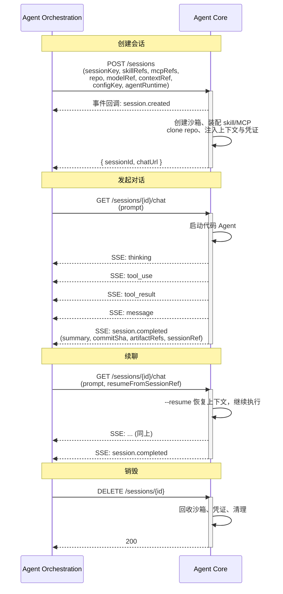

# Agent Core 接口与能力要求

> 文档定位：定义 Agent Core 暴露给外部的接口契约，以及每个接口下 Agent Core 需具备的能力。本文不涉及编排层（Agent-Orchestration）的职责——编排层如何调度 session、如何判定转任务等，由编排层文档自行定义。
>
> 核心约定：**两个核心接口**完成所有工作——`POST /sessions` 创建会话，`GET /sessions/{id}/chat` 进行对话。其余接口辅助。

## 0. 总览

Agent Core 是 Agent 的运行时执行层。它的核心工作是：**接收 session 配置，在隔离沙箱内启动代码 Agent，把执行过程流式返回。**

### 核心能力

**对话与执行**：接收 prompt，在沙箱内启动代码 Agent（支持多种 agentRuntime，如 Claude Code），流式返回执行事件。对话上下文持久化落盘，进程可死、重连可续。

**隔离**：每个 session 的对话、文件、进程、网络相互隔离。跨 session 的文件传递只通过代码仓 commit/checkout。

**安全**：网络默认最小出网、工具 allowlist、文件只能在允许路径内访问、危险操作拦截上报。凭证短周期、作用域限本 session。

**环境准备**：按 session 配置拉取装配 skill 和 MCP server、挂载知识库、注入项目上下文（agents.md）、按需 clone 代码仓、注入短期凭证。相同配置的 session 可通过 `configKey` 缓存环境模板快速复用。

**资源管理**：沙箱对编排层透明——创建、冻结、解冻、回收全由 Agent Core 内部决定。session 可施加资源配额，空闲时冻结释放算力。

### 接口

| 接口 | 定位 | 说明 |
|---|---|---|
| `POST /sessions` | **核心** | 创建会话，传入 skill/MCP/知识库/代码仓/contextRef，返回 `sessionId` + chat 地址 |
| `GET /sessions/{id}/chat` | **核心** | 对话——建连即开始/续接对话，流式返回所有执行事件 |
| `POST /sessions/{id}/abort` | 辅助 | 中止当前对话，保留 session 可续聊 |
| `GET /sessions/{id}` | 辅助 | 查询 session 状态，供外部轮询判活 |
| 事件回调 → 外部 | 辅助 | 生命周期事件主动推送 |
| `DELETE /sessions/{id}` | 辅助 | 销毁 session |

### 架构

```text
┌─ Agent Orchestration（编排层）───────────────────────────────────────┐
│                                                                     │
│  ┌─ Workflow ─────────────┐    ┌─ 通用任务 ───────────┐            │
│  │                        │    │                      │            │
│  │  step DAG              │    │  无需模板，即席触发     │            │
│  │  run/step/attempt 状态机│    │                      │            │
│  │  requiresConfirmation   │    │                      │            │
│  │                        │    │                      │            │
│  └───────────┬────────────┘    └──────────┬───────────┘            │
│              │ step 就绪                    │ 触发 session 创建        │
│              └──────────┬──────────────────┘                         │
│                         ▼                                            │
│  组装 & 调度：                                                       │
│    · skill 列表（按 agent 组装）                                       │
│    · MCP 列表（按 agent 组装）                                         │
│    · 知识库引用                                                        │
│    · 项目上下文（agents.md）                                           │
│    · 代码仓（RepoRef）                                                │
│    · 模型（modelRef）                                                  │
│    · 执行器类型（agentRuntime）                                        │
│    · 配置缓存键（configKey）                                           │
│    · 持有 sessionKey ↔ sessionId                                       │
│    · 调度：创建 / 续聊 / 销毁 session                                   │
│                                                                     │
└───────────────────────────┬─────────────────────────────────────────┘
                           │
       POST /sessions      │      GET /sessions/{id}/chat
       GET /sessions/{id}  │      POST /sessions/{id}/abort
       DELETE /sessions/{id}│
                           │  ← 事件回调
                           │    (created / completed / failed / aborted / timeout / heartbeat)
                           │
┌──────────────────────────▼────────────────────────────────────────┐
│                    Agent Core（运行时层）                           │
│                                                                   │
│  session 生命周期管理                                              │
│                                                                   │
│  ┌─ 沙箱（编排层不可见）───────────────────────────────────────┐  │
│  │                                                            │  │
│  │  代码 Agent（claude-code / open-code / ...）                │  │
│  │  装配的 skill / MCP       clone 的代码仓       workspace 卷  │  │
│  │                                                            │  │
│  └────────────────────────────────────────────────────────────┘  │
│                                                                   │
│  对话隔离 / 文件隔离 / 进程隔离 / 网络隔离                           │
│  网络 egress 管控 / 工具 allowlist / 凭证注入与回收                   │
│  事件流（SSE）+ 回调上报                                           │
│                                                                   │
└───────────────────────────────────────────────────────────────────┘
```

### 时序



---

## 1. 核心接口一：POST /sessions（创建会话）

优先级：**P0**

创建会话，传入本轮执行所需的全量配置。Agent Core 准备环境，返回 `sessionId` 和 对话地址。

### 1.1 Request

| 字段 | 类型 | 必填 | 说明 |
|---|---|---|---|
| `sessionKey` | string | 是 | 外部侧的 session 标识，供外部映射 |
| `configKey` | string | 否 | 配置缓存键。相同 `configKey` 的 session 配置相同（skill/MCP/知识库/repo/agentRuntime 一致），Agent Core 可复用已缓存的环境模板，跳过重复准备 |
| `skillSnapshotRefs` | string[] | 是 | Skill 快照引用列表（编排层已按 agent 组装好） |
| `mcpSnapshotRefs` | string[] | 是 | MCP Server 快照引用列表（编排层已按 agent 组装好） |
| `knowledgeBaseRefs` | string[] | 否 | 知识库引用列表 |
| `contextRef` | string | 否 | 项目空间知识说明引用（如 agents.md，包含项目背景、编码规范、约定） |
| `modelRef` | string | 否 | 模型引用，指定本轮对话使用的模型。Agent Core 据此选择模型端点、注入对应 credential。不传则使用默认模型 |
| `repo` | RepoRef | 否 | 代码仓引用（repoUrl / branch / commit）。不传则为无 repo 会话 |
| `agentRuntime` | string | 是 | 执行器类型（见 §5） |

### 1.2 Response

| 字段 | 类型 | 说明 |
|---|---|---|
| `sessionId` | string | Agent Core 分配的 session 标识 |
| `chatUrl` | string | 对话连接地址 |

**幂等**：同一 `sessionKey` 重复调用返回已有 `sessionId`。

### 1.3 此接口要求 Agent Core 具备的能力

| 能力 | 优先级 | 说明 |
|---|---|---|
| Skill 装配 | P0 | 按 `skillSnapshotRefs` 拉取 skill 内容，装载进当前 session |
| MCP Server 装配 | P0 | 按 `mcpSnapshotRefs` 拉取配置，启动或注册 MCP server，注入短期凭证 |
| 知识库挂载 | P0 | 按 `knowledgeBaseRefs` 以只读方式挂载文件形态知识库，或注册检索服务形态知识库 |
| 上下文注入 | P0 | 按 `contextRef` 拉取项目知识说明（agents.md），注入本 session 对话上下文 |
| 代码仓 clone | P0 | 按 `RepoRef` clone/checkout 代码仓；clone 时机由 Agent Core 自定 |
| 沙箱创建 | P0 | 为本 session 创建隔离沙箱（容器/进程组 + 挂载 workspace 卷），完成环境准备 |
| 凭证注入 | P0 | 为本 session 注入短期凭证，作用域限本 session |
| 配置缓存 | P1 | 对相同 `configKey` 的 session，缓存已就绪的环境模板（已装配的 skill/MCP、已 clone 的 repo 等），后续同配置 session 创建时跳过环境准备、快速复用 |
| MCP server 复用 | P2 | 相邻 session 相同 MCP 快照时复用已启动进程 |

---

## 2. 核心接口二：GET /sessions/{sessionId}/chat（对话）

优先级：**P0**

Agent Core 的**核心执行通道**。外部通过 SSE 长连接进行对话。

### 2.1 建连参数

| 参数 | 类型 | 必填 | 说明 |
|---|---|---|---|
| `prompt` | string | 是 | 已渲染的 prompt 文本 |
| `resumeFromSessionRef` | string | 否 | 续聊时指向要恢复的对话上下文；为空表示新建对话 |

> **单会话串行**：同一 session 同时只允许一个活跃对话连接。已有对话执行中时，新建连请求被拒绝或排队（断连重连场景下旧连接需先释放），避免同一对话上下文被并发写坏。

### 2.2 事件流

统一基座字段：

| 字段 | 类型 | 说明 |
|---|---|---|
| `eventId` | string | 事件唯一标识，供去重 |
| `eventType` | string | 见下表 |
| `sessionId` | string | 归属 session |
| `sequence` | long | 递增序号，供排序与断线重连 |
| `timestamp` | datetime | 事件产生时间 |
| `payload` | object | 具体内容，按 eventType 不同 |

事件类型：

| eventType | 说明 |
|---|---|
| `thinking` | Agent 思考过程 |
| `message` | Agent 回复消息 |
| `tool_use` | 工具调用请求 |
| `tool_result` | 工具调用结果 |
| `stdout` / `stderr` | 标准输出/错误 |
| `session.completed` | 本轮对话执行成功（payload 含 summary / result / artifactRefs / commitSha / sessionRef） |
| `session.failed` | 本轮对话执行失败（payload 含 failureReason） |
| `governance.signal`（P2） | 审查规则命中 + 规模信号（工具调用数/耗时/改动范围） |

**session.completed payload：**

| 字段 | 类型 | 说明 |
|---|---|---|
| `summary` | string | 必填，给前端展示 |
| `result` | string | 可选，完整文本结果 |
| `artifactRefs` | string[] | 可选，指向对象存储的产物 |
| `commitSha` | string | 若本次有代码改动，返回 commit 的 sha |
| `sessionRef` | string | 本轮对话上下文标识，供续聊时作为 `resumeFromSessionRef` |

### 2.3 此接口要求 Agent Core 具备的能力

#### （A）对话与执行

| 能力 | 优先级 | 说明 |
|---|---|---|
| 对话执行 | P0 | 接收 prompt，启动 Agent 执行，经 SSE 流式返回所有事件 |
| 续聊 | P0 | 断连后重连 SSE，带 `resumeFromSessionRef` 恢复对话上下文继续执行 |
| 对话中止 | P0 | 提供 `POST /sessions/{id}/abort` 中止当前正在执行的对话（不销毁 session），停止 agent 执行、保留上下文，session 仍可续聊。幂等 |
| 单会话串行 | P0 | 同一 session 同时只允许一个活跃对话连接，避免并发写坏对话上下文 |
| 进程可死 + 对话恢复 | P0 | 对话上下文持久化落盘（键 = sessionRef），执行进程退出后上下文不丢。续聊时 `--resume` 重载即可恢复。外部对进程冷热无感知 |
| 代码仓操作 | P0 | 对话过程中 agent 的代码改动经 Agent Core commit/push |
| 治理信号上报 | P2 | 执行中上报审查规则命中 + 规模信号（工具调用数/耗时/改动范围），供外部判定转任务或提示 |

#### （B）隔离

| 能力 | 优先级 | 说明 |
|---|---|---|
| 对话隔离 | P0 | 不同 session 的对话上下文互不可见。Agent 不能跨 session 读取其他对话的消息历史 |
| 文件隔离 | P0 | 不同 session 的文件操作相互隔离。session 间不共享本地盘，文件传递只能通过代码仓 commit/checkout |
| 进程隔离 | P0 | 不同 session 的执行进程互不可见，进程命名空间隔离 |
| 网络隔离 | P0 | 不同 session 的网络命名空间隔离 |
| 凭证隔离 | P0 | 凭证作用域限本 session，session 结束后回收。不在日志、事件、SSE 流中回显凭证明文 |

#### （C）安全

| 能力 | 优先级 | 说明 |
|---|---|---|
| 文件系统边界 | P0 | Agent 只能访问本 session 的 workspace 路径及显式挂载的只读路径（如知识库文件）。越界读写被拒绝 |
| 网络 egress 管控 | P1 | 默认最小化出网，仅放行 allowlist（模型端点、已批准 MCP server、repo 源、知识库服务）。禁止任意外联 |
| 工具 / 命令 allowlist | P1 | 可执行的工具、命令、文件路径受策略约束。不开放任意脚本执行、任意文件系统访问 |
| 危险操作拦截 | P1 | 命中高风险操作（修改鉴权配置、删除数据、变更 CI 流水线、访问生产环境、越权操作）时阻断执行并上报 |

---

## 3. 辅助接口

### 3.1 GET /sessions/{sessionId}（查询状态）

优先级：**P0**

供外部轮询判活（外部 pull 驱动，Agent Core 无需主动推心跳）。

**Response：**

| 字段 | 类型 | 说明 |
|---|---|---|
| `sessionId` | string | session 标识 |
| `status` | enum | `ACTIVE` / `COMPLETED` / `FAILED` |
| `lastActiveAt` | datetime | 最近活跃时间，供外部判活 |

**要求具备的能力：**

| 能力 | 优先级 | 说明 |
|---|---|---|
| 状态查询 | P0 | 返回 session 当前状态及最近活跃时间 |

---

### 3.2 事件回调（Agent Core → 外部）

优先级：**P0**

SSE 之外的补充通道，主动推送生命周期事件。展示类事件（thinking/message/tool_*）走 SSE，生命周期事件走此回调。

**回调事件：**

| eventType | 说明 |
|---|---|
| `session.created` | session 已创建 |
| `session.completed` | session 执行成功 |
| `session.failed` | session 任务失败（agent 跑完判定失败）|
| `session.aborted` | 运行时异常（沙箱崩溃/OOM）——区别于任务失败，编排层可据此重建重试 |
| `session.timeout` | 执行超时 |
| `session.heartbeat` | 定期心跳（外部兜底判活） |

事件基座字段同 SSE。

**要求具备的能力：**

| 能力 | 优先级 | 说明 |
|---|---|---|
| 生命周期事件推送 | P0 | session 创建/失败/心跳等事件主动回调外部 |
| 资源指标上报 | P2 | 上报 token 消耗、执行耗时、资源占用等指标，供成本归属与告警 |

---

### 3.3 DELETE /sessions/{sessionId}（销毁 session）

优先级：**P0**

外部在 session 不再需要时通知 Agent Core 销毁。**幂等**。

**要求具备的能力：**

| 能力 | 优先级 | 说明 |
|---|---|---|
| 沙箱回收 | P0 | session 销毁时回收沙箱及所有关联资源（容器、进程、临时存储） |
| 凭证回收 | P0 | 回收本 session 的短期凭证 |
| 清理幂等 | P0 | session 已不存在时返回可识别状态，不报错 |

---

## 4. 跨接口的 Agent Core 内部能力

以下能力不归属单一接口，是 Agent Core 整体需具备的。

| 能力 | 优先级 | 说明 |
|---|---|---|
| 能力集按 session 独立 | P0 | 不同 session 的 skill/MCP/知识库/上下文相互独立，按各自初始化参数装配，互不干扰 |
| 资源配额 | P1 | 每个 session 可施加资源配额上限（CPU/内存/磁盘/时长），超限按策略处理 |
| 容量背压 | P1 | 资源池不足时 session 创建快速拒绝，不长时间阻塞 |
| 沙箱冻结 / 解冻 | P1 | session 空闲时冻结沙箱以释放算力、保留文件，需要时解冻恢复 |
| 沙箱空闲流转 | P2 | session 空闲时沙箱按策略自动流转（存活→冻结→回收），逐级释放资源 |
| session 数据保留 | P1 | 以用户为单位，保留最近 50 条 session 且超过 15 天的才删除。两个条件同时满足方可清理：保留天数 ≥ 15 天 AND 用户 session 数 > 50 条。15 天内或不足 50 条的 session 即使空闲也不回收数据 |
| 镜像治理 | P2 | 执行环境镜像受版本与来源管控，保证可复现、可审计 |

> **排期前提**：工作流依赖所有 P0 + P1。P2 为长期优化项。沙箱冻结/解冻因工作流需要已在 P1。

---

## 5. agentRuntime —— 支持的代码 Agent 类型

`agentRuntime` 指定本轮执行所用的 Agent 运行时。Agent Core 需支持多种类型的代码 Agent，每种对应不同的执行器实现。当前已知需支持：

| agentRuntime | 说明 |
|---|---|
| `claude-code` | Anthropic Claude Code —— CLI 形态的代码 Agent，在沙箱内以 `claude` 命令执行，支持文件读写、命令执行、git 操作 |
| （后续扩展） | 如 open-code、aider、自研 agent 等，由 Agent Core 按 agentRuntime 路由到对应执行器 |

Agent Core 在 session 初始化时，根据 `agentRuntime` 选择对应的执行器实现，根据 `modelRef` 选择本次使用的模型。不同执行器的 skill/MCP 装配方式、prompt 格式、事件协议由 Agent Core 内部适配，对外接口（事件流）保持统一协议。

---

## 6. 不同场景的初始化性能与沙箱选择

session 初始化的入参决定了任务类型，任务类型决定了所需的隔离强度与启动成本。Agent Core 应**根据任务类型自动决策使用哪种沙箱**，用最小成本满足隔离要求——隔离强度不只看任务大小，更看是否运行不可信代码。

### 6.1 场景分级

| 场景 | 入参特征 | 需要做的事 | 启动性能要求 | 沙箱选型建议 |
|---|---|---|---|---|
| **普通对话** | 无 `repo`、无外部工具或仅可信工具 | 纯 LLM 推理 / 轻量工具调用 | 百毫秒级 | 可不用沙箱（或 WASM 等轻量运行时） |
| **中等** | 无 `repo`，有 `contextRef`、较多 skill/MCP | 注入上下文、装配 MCP 服务，可读知识库 | 秒级 | Firecracker microVM —— 装配较多外部 MCP/知识库（潜在不可信），需强隔离 |
| **完整** | 有 `repo`，需要 clone 代码仓 | 完整开发环境：文件系统、命令执行、git 操作 | 十秒级 | 容器沙箱 —— 项目自有代码相对可信，且文件 IO / 命令执行性能更好 |

> 沙箱选型为建议方向，具体实现由 Agent Core 自行决定。编排层只传 `repo` / `contextRef` / `skillSnapshotRefs` 等字段，不感知沙箱类型；由 Agent Core 据此判断任务类型并决策沙箱。

### 6.2 与 configKey 的配合

相同 `configKey` 的 session，Agent Core 可缓存已就绪的沙箱模板——在此之上预热同级场景可进一步缩短启动时间。例如同一个项目下复用 repo，可跳过 clone 直接在缓存模板上处理。

### 6.3 续聊恢复性能

续聊时根据**上次对话结束至今的空闲时长**分级恢复，空闲越短恢复越快：

| 空闲时长 | 恢复方式 | 目标恢复时间 | 说明 |
|---|---|---|---|
| < 5 分钟 | 热恢复 | 毫秒级 | 沙箱仍在 WARM 态，直接续聊 |
| > 5 分钟 | 冷恢复 | 十秒级 | 沙箱已冻结或回收，重新创建后 `--resume` 冷启 |

Agent Core 内部通过冻结、缓存、预热等机制实现分级恢复。编排层对冷热无感知——续聊一律走 `GET /sessions/{id}/chat`，只体现在响应延迟差异。

---

## 7. 与既有文档的关系

- 本文定义 Agent Core 的接口契约与能力要求；编排层文档据此调用
- 编排层自身职责（调度策略、session 映射、审查流程、转任务判定）由编排层文档自行定义

---

## 8. 待确认 / 后续

| # | 议题 | 说明 |
|---|---|---|
| 1 | 续聊参数传递方式 | `resumeFromSessionRef` 通过 SSE 建连 query 参数还是首条事件传 |
| 2 | 终态事件双通道 | `session.completed` 在 SSE 和回调两通道——两边内容是否完全一致 |
| 3 | 沙箱冻结/解冻阈值 | Agent Core 自行决定 |
| 4 | session 配额与并发 | 按用户/项目限制活跃 session 数量 |
| 5 | 跨 session 代码仓并发 | 同 repo 多 session 并行修改的隔离/加锁 |
| 6 | MCP server 跨 session 复用 | 健康检查与失效回收 |