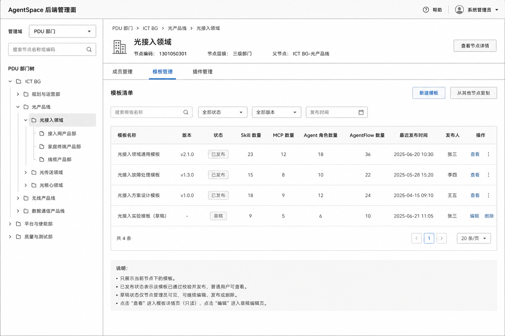
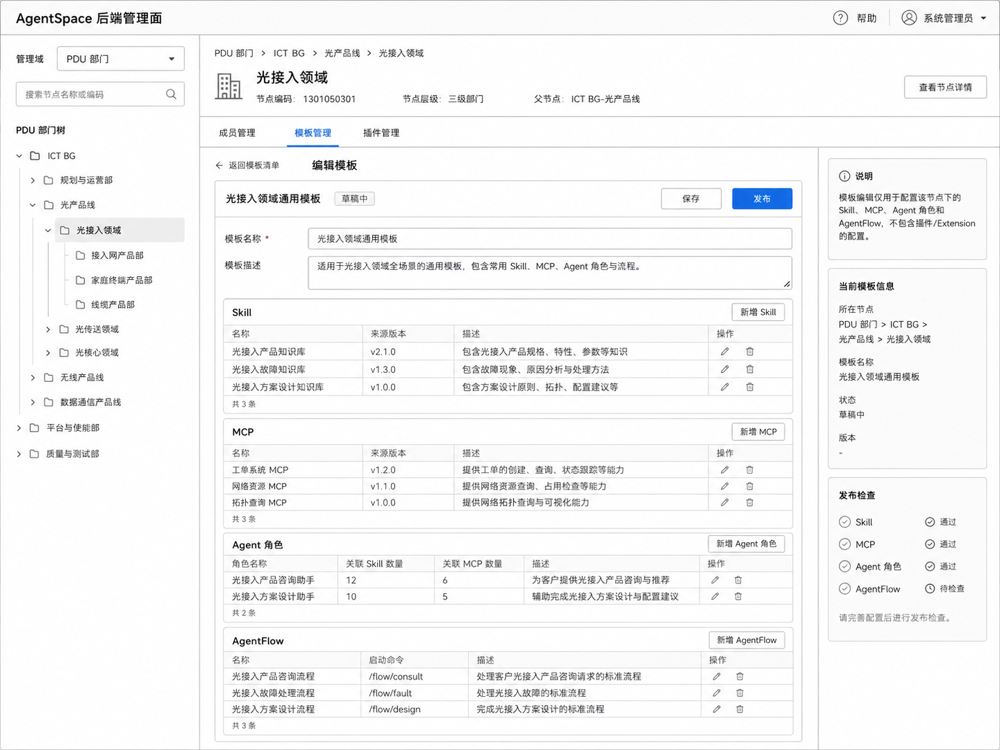
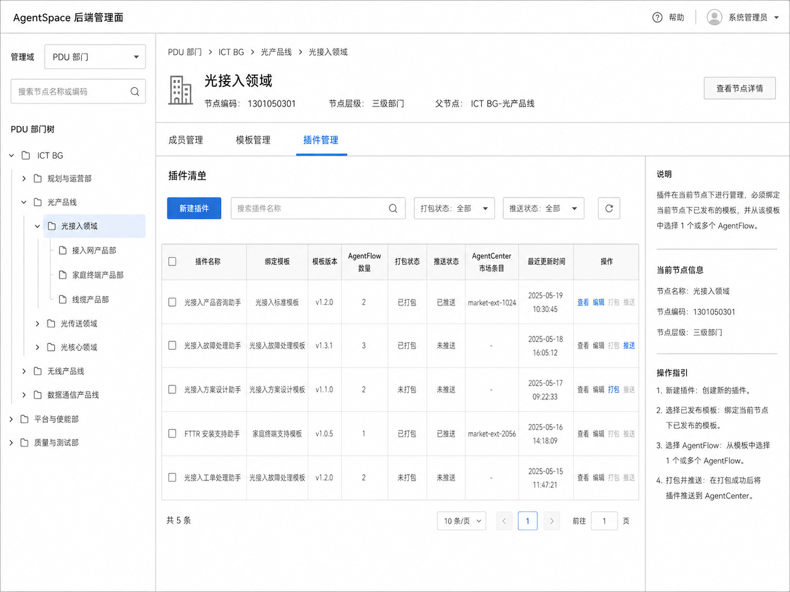
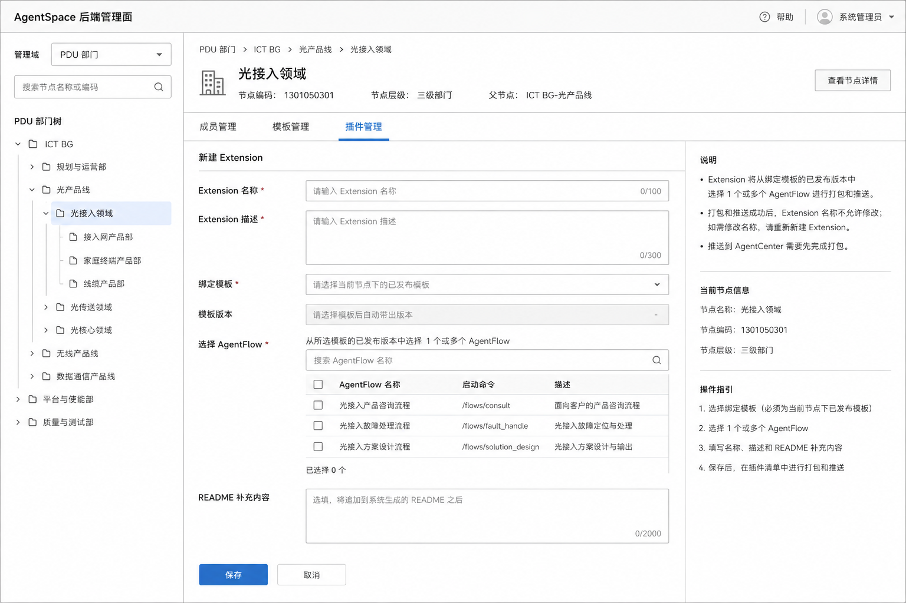

# AgentSpace 后端管理面

## 1. 基本信息

| 字段 | 内容 |
| --- | --- |
| 模块名称 | AgentSpace 后端管理面 |
| 最近更新 | 2026-06-23 |
| 模块目标 | 在统一页面内支持节点模板浏览、成员管理、模板管理和插件管理，通过身份与权限校验区分只读浏览态与管理态 |
| 适用角色 | 所有已登录 AgentSpace 用户；系统管理员和节点管理员具备授权范围内的管理能力 |
| 导航入口 | 独立页面“AgentSpace 配置中心” |
| 上位定义 | AgentSpace 产品定义 |
| 复用模块 | Harness 工程配置 |
| 备注 | 低保真图和文字描述有冲突时以文字描述为准，低保真图仅供主要排版的参考 |

---

## 2. 模块定位与边界

### 2.1 模块定位

本模块是 AgentSpace 的统一节点模板页面，同时承载两类场景：

1. **全员模板浏览**：所有已登录用户都可以进入页面，选择某个系统级节点或 PDU 部门节点，查看该节点下已发布模板清单，并点击模板查看已发布模板配置详情。
2. **后台管理**：具备对应节点管理权限的用户，在同一页面中可以维护成员管理、模板管理和插件管理。

页面不再拆分“全员模板浏览页”和“模板管理后台”。用户点击节点时，系统根据当前用户身份和权限决定右侧展示内容：

- 非管理员：仅展示“模板管理”栏目，且为只读浏览态。
- 管理员：根据当前节点和权限范围展示“成员管理 / 模板管理 / 插件管理”栏目，并在权限范围内提供编辑、保存、发布和新建版本能力。

### 2.2 与团队空间的关系

本版本中，节点模板不在新建团队空间时复用，也不会自动影响已有团队空间 Harness。

下个迭代计划支持：新建团队空间时选择某个系统级节点或 PDU 部门节点下的某个已发布模板，基于该模板初始化团队空间 Harness。为支持后续能力，本版本应保留模板来源节点、模板版本、模板内对象标识等可追溯信息。

### 2.3 包括

- 管理域选择：用户先选择“系统级”或“PDU 部门”，再展示当前管理域下的节点树。
- 系统级节点树：当前仅包含一个“系统节点”，未来可能扩展其他系统级节点。
- PDU 部门树：展示一级至五级部门节点，不包含系统节点。
- 所有已登录用户可以查看任意可见节点下的已发布模板清单和模板配置详情。
- 管理员可以维护授权范围内节点的成员管理、模板管理和插件管理；系统管理员对 PDU 部门节点仅具备成员管理编辑权限。
- 一个节点可以创建多个模板；模板之间隔离。
- 模板管理负责配置 Skill、MCP、Agent 角色和 AgentFlow，并执行保存、编辑和发布。
- 插件管理与模板管理并列，基于当前节点进行管理。
- 插件可以绑定当前节点下某个已发布模板版本，并选择该模板版本中的一个或多个 AgentFlow。
- 插件发布时打包为 ZIP，并推送到当前用户所属且有权限的 AgentCenter 市场组织。
- 记录成员授权、模板保存、模板发布、插件保存、插件发布和权限拒绝审计。

### 2.4 不包括

- 新建、编辑、删除、移动或合并 PDU 部门节点。
- 在本版本中新建团队空间时选择节点模板初始化 Harness。
- 将节点模板自动同步到团队空间 Harness。
- 节点模板中的知识库、Agent.md 和环境变量配置。
- AgentCenter 市场中的插件审核、上架、下架和组织成员管理。
- 打包服务和 AgentCenter 的底层实现。
- 具体接口、数据库表和服务部署设计。

---

## 3. 核心概念

### 3.1 管理域

管理域用于区分不同节点树来源。用户进入页面后先选择管理域，再查看该管理域下的节点树。

| 管理域 | 说明 |
| --- | --- |
| 系统级 | AgentSpace 内部的系统级节点树，当前只有一个系统节点，未来可扩展其他系统级节点 |
| PDU 部门 | 来自 PDU 的部门节点树，包含一级至五级部门，不包含系统节点 |

系统级节点不属于 PDU 部门树。PDU 部门树不再包含系统节点。

### 3.2 管理节点

管理节点是系统级节点和 PDU 部门节点在本模块中的统一抽象。成员管理、模板管理和插件管理都基于管理节点进行。

管理节点包含：

- 节点标识。
- 节点名称。
- 所属管理域。
- 父子关系。
- 节点状态。

系统级节点由 AgentSpace 定义；PDU 部门节点由 PDU树 提供，AgentSpace 只读取并展示，不允许编辑。

### 3.3 节点模板

节点模板是独立于团队空间 Harness 的主数据对象。一个管理节点可以创建多个模板，不同模板之间相互隔离。

每个节点模板内仅包含：

- Skill。
- MCP。
- Agent 角色。
- AgentFlow。

模板管理不包含插件配置。插件已从模板管理中剥离，作为与模板管理并列的节点级功能。

节点模板的核心关系为：

```text
AgentSpace 节点模板
  - 引用 AgentCenter 中的 Skill / MCP
  - 编排 Agent / AgentFlow
  - 发布后供全员只读查看，并供本节点插件选择 AgentFlow
```

节点模板发布只产生该模板的已发布版本，不同步到 AgentCore，也不自动改变任何团队空间。

### 3.4 插件 / Extension

插件管理是基于管理节点的独立功能，与模板管理并列。插件归属于当前管理节点，不归属于某个模板草稿。

每个插件必须绑定当前节点下某个已发布模板版本，并从该模板版本中选择一个或多个 AgentFlow。插件发布时基于绑定模板版本中的已发布 AgentFlow 生成 ZIP，并推送到 AgentCenter 市场。保存插件只更新草稿态配置，不产生市场版本。

插件的核心关系为：

```text
节点插件 / Extension
  - 归属于某个管理节点
  - 绑定该节点下的某个已发布模板版本
  - 选择该模板版本中的一个或多个 AgentFlow
  - 发布时打包为 ZIP
  - 发布时推送到 AgentCenter 市场
```

插件首次成功发布后，Extension 名称锁定，不允许修改。如果需要改名，必须新建 Extension 并发布到市场。

### 3.5 产品级对象

| 对象 | 产品含义 |
| --- | --- |
| `ManagementDomain` | 管理域，区分系统级和 PDU 部门 |
| `ManagementNode` | 管理节点，统一表示系统级节点或 PDU 部门节点 |
| `NodeAdminGrant` | 用户对指定管理节点的显式管理员授权及授权来源、状态和审计信息 |
| `NodeHarnessTemplate` | 节点级 Harness 模板，归属于某个管理节点，一个节点可拥有多个模板 |
| `NodeHarnessTemplateDraft` | 某个节点模板的当前草稿 |
| `NodeHarnessTemplateVersion` | 某个节点模板的已发布版本，不可变，用于全员查看、插件绑定和后续团队空间初始化预留 |
| `NodeExtension` | 节点级插件定义，归属于某个管理节点，绑定某个已发布模板版本 |
| `PackageArtifact` | 基于某次插件发布配置和绑定模板版本生成的 ZIP 产物 |
| `AgentCenterPushRecord` | 插件发布推送的目标组织、版本、操作者和结果 |

---

## 4. 页面信息架构

### 4.1 页面整体布局

页面采用左右结构：

- 左侧顶部为管理域选择器，用户先选择“系统级”或“PDU 部门”。
- 左侧主体展示当前管理域下的节点树，同一时间只展示一棵树。
- 右侧为当前节点详情，顶部展示节点名称、完整路径、当前用户权限。
- 右侧主体根据身份展示不同栏目。

### 4.2 管理域选择

用户进入页面后，先选择一个管理域：

```text
管理域选择器
  - 系统级
  - PDU 部门
```

选择“系统级”时：

- 左侧只展示系统级节点树。
- 当前仅包含一个“系统节点”。
- 未来可扩展其他系统级节点。

选择“PDU 部门”时：

- 左侧只展示 PDU 部门树。
- 展示一级至五级部门。
- 不展示系统节点。

搜索只在当前选中的管理域内进行。切换管理域前，如当前页面存在未保存修改，要求用户确认放弃或继续编辑。

### 4.3 节点详情栏目展示规则

用户点击某个节点后，系统先校验身份和该节点权限，再决定右侧栏目展示。

| 用户身份 | 栏目展示 | 能力 |
| --- | --- | --- |
| 非管理员 | 仅展示“模板管理” | 只读查看已发布模板清单；点击模板查看已发布配置详情；不可查看草稿；不可编辑、保存、发布、新建版本 |
| 系统管理员 - 系统级节点 | 展示“成员管理 / 模板管理 / 插件管理” | 可编辑所有系统级节点的成员、模板、插件 |
| 系统管理员 - PDU 部门节点 | 展示“成员管理 / 模板管理” | 可编辑所有 PDU 部门节点的成员；模板管理仅为只读浏览态；不展示插件管理；不可编辑 PDU 部门节点的模板和插件 |
| 节点管理员 | 展示“成员管理 / 模板管理 / 插件管理” | 可编辑本节点和直属下一层级节点的成员、模板、插件 |

非管理员看到的“模板管理”是浏览态，不是管理态。系统管理员进入 PDU 部门节点时，模板管理同样为浏览态。页面名称保持一致，但操作能力和信息范围不同。

### 4.4 模板管理栏目

模板管理栏目在不同身份下有两种模式。

#### 4.4.1 非管理员浏览态

非管理员点击节点后，只保留“模板管理”栏目。该栏目展示当前节点下所有已发布模板清单。

模板清单展示：

- 模板名称。
- 模板描述。
- 最近成功发布版本。
- 最近成功发布时间。
- Skill / MCP / Agent 角色 / AgentFlow 数量。
- 发布人。

非管理员可以点击某个模板进入模板配置详情，只读查看：

- Skill 清单及详情。
- MCP 清单及详情。
- Agent 角色清单及详情。
- AgentFlow 清单及详情。
- 模板版本信息。

非管理员不可查看：

- 模板草稿。
- 未发布模板。
- 编辑入口。
- 保存和发布按钮。
- 成员管理。
- 插件管理。
- 插件发布记录中的管理操作入口。

如果当前节点没有已发布模板，展示“该节点暂无已发布模板”。

#### 4.4.2 管理员管理态

管理员点击有模板管理权限的节点后，模板管理展示当前节点下的模板清单，并提供管理操作。系统管理员进入 PDU 部门节点时不进入模板管理态，只能按浏览态查看已发布模板。

模板清单展示：

- 模板名称。
- 模板描述。
- 草稿状态。
- 最近成功发布版本。
- 最近成功发布时间。
- Skill / MCP / Agent 角色 / AgentFlow 数量。
- 最近编辑人和最近编辑时间。
- 最近发布人和最近发布时间。
- 操作：新建、编辑、查看已发布详情、发布、复制其他节点、删除草稿模板、查看版本发布记录。

管理员进入模板编辑页后，可配置：

- Skill。
- MCP。
- Agent 角色。
- AgentFlow。

模板编辑页不展示插件配置。插件配置统一在“插件管理”栏目中进行。

### 4.5 插件管理栏目

插件管理与模板管理并列，只对具备当前节点插件管理权限的管理员展示。系统管理员进入 PDU 部门节点时不展示插件管理。

插件管理展示当前节点下的插件清单，不展示其他节点插件。插件清单展示：

- 插件名称。
- 插件版本号。
- 绑定模板名称。
- 绑定模板版本号。
- 最近更新时间。

新建插件时，管理员只能选择当前节点下的已发布模板版本，不能跨节点绑定其他节点模板。选择模板后，再从该模板版本中选择一个或多个 AgentFlow。

### 4.6 成员管理栏目

成员管理只对具备当前节点成员管理权限的管理员展示。

成员列表只展示当前节点的显式授权管理员，不展示因为上级节点权限继承而拥有当前节点管理能力的上级管理员。

例如：一级部门管理员可以管理直属二级部门的成员、模板和插件，但当进入该二级部门成员管理时，不出现在二级部门管理员名单中，除非该用户也被显式授权为该二级部门管理员。系统管理员进入 PDU 部门节点时可以维护成员管理，但不能维护该节点的模板管理和插件管理。

---

## 5. 节点树与状态

### 5.1 系统级节点树

系统级节点树由 AgentSpace 定义，当前仅包含一个系统节点。未来可扩展其他系统级节点。

系统级节点可以拥有：

- 成员管理。
- 多个节点模板。
- 多个节点插件。

### 5.2 PDU 部门树

PDU 部门树由 PDU 提供。AgentSpace 只读取并展示以下节点：

- 一级部门。
- 二级部门。
- 三级部门。
- 四级部门。
- 五级部门。

PDU 部门树不包含系统节点。节点名称、编码、层级、父节点和有效状态均由 PDU树 提供，AgentSpace 不允许编辑。

### 5.3 节点树交互

- 切换管理域后，左侧展示对应节点树。
- 首次进入可默认选择“系统级”管理域下的系统节点，也可按用户最近访问记录恢复。
- 展开和收起只改变页面展示，不改变节点数据。
- 搜索命中节点时同时展示其祖先路径，避免同名节点无法定位。
- 可以选择仅展示本人有管理权限的节点，或展示全量节点。
- 所有已登录用户都可以选择任意可见节点并查看其已发布模板。
- 节点没有已发布模板时，对非管理员展示统一空状态，不展示草稿信息。

### 5.4 节点状态

| 状态 | 页面表现 |
| --- | --- |
| 正常 | 可按权限浏览或维护成员、模板、插件 |
| PDU 已删除 | 不再出现在正常 PDU 部门树中；模板、授权和记录归档，仅在审计或历史引用场景只读查看 |
| PDU 已移动或重命名 | 按 PDU 最新结构和名称展示，模板和插件仍通过稳定节点标识关联 |
| PDU 同步失败 | 使用最近一次成功同步快照只读展示，并禁止成员、模板和插件写操作 |
| 系统级节点停用 | 不在正常系统级树中展示；历史模板、插件和审计仅保留只读追溯 |

---

## 6. 成员管理与权限

### 6.1 角色定义

| 角色 | 管理能力 |
| --- | --- |
| 系统管理员 | 可以编辑所有系统级节点和所有 PDU 部门节点的成员管理；仅可以编辑所有系统级节点的模板管理和插件管理；不能编辑 PDU 部门节点的模板管理和插件管理 |
| 一级部门节点管理员 | 可以编辑本一级节点和直属二级节点的成员管理、模板管理和插件管理 |
| 二级部门节点管理员 | 可以编辑本二级节点和直属三级节点的成员管理、模板管理和插件管理 |
| 三级部门节点管理员 | 可以编辑本三级节点和直属四级节点的成员管理、模板管理和插件管理 |
| 四级部门节点管理员 | 可以编辑本四级节点和直属五级节点的成员管理、模板管理和插件管理 |
| 五级部门节点管理员 | 可以编辑本五级节点的成员管理、模板管理和插件管理；没有下级节点管理能力 |
| 普通用户 | 可以进入页面并查看任意可见节点的已发布模板清单和模板配置详情，不可执行写操作 |

系统管理员是本模块的平台级治理角色，不等同于团队空间管理员。团队空间角色不会自动获得本模块写权限。

### 6.2 授权规则

- 每个管理节点可以同时拥有多名显式授权管理员。
- 管理员候选人只要求是可被公司统一身份系统识别的有效用户，不限制其本人所属 PDU 部门。
- 系统管理员可以维护所有系统级节点和 PDU 部门节点的管理员。
- 系统管理员只能维护系统级节点的模板和插件，不能维护 PDU 部门节点的模板和插件。
- 部门节点管理员可以维护本节点和直属下一层级节点管理员。
- 部门节点管理员不能跨级、跨子树或维护同级其他节点的管理员。
- 五级部门节点管理员只能维护本节点管理员，不能授权下级管理员。
- 上级节点管理员对直属下一层级节点拥有管理能力，但不会自动成为下一层级节点的显式管理员。
- 成员管理列表只展示当前节点显式授权管理员，不展示继承获得管理能力的上级管理员。
- 授权立即生效；撤销后，用户下一次写请求必须按最新权限拒绝。
- 授权关系不物理删除，保留授权人、授权来源、授权时间、撤销人、撤销时间和状态。

### 6.3 成员管理页面

成员管理列表展示：

- 用户姓名和统一身份标识。

添加管理员流程：

1. 有权限的管理员选择目标节点。
2. 搜索并选择一个或多个有效用户。
3. 系统再次校验操作者权限、目标节点层级和用户有效性。
4. 写入显式授权并记录审计。
5. 刷新目标节点成员管理列表。

撤销管理员前展示影响确认。目标用户正在编辑时，后端在下一次保存、发布或新建版本请求中拒绝操作，前端切换为只读并保留未提交内容供复制。

### 6.4 权限矩阵

| 能力 | 普通用户 | 系统管理员 | 当前节点管理员 | 合法上级节点管理员 |
| --- | --- | --- | --- | --- |
| 进入页面 | 是 | 是 | 是 | 是 |
| 查看任意可见节点已发布模板清单 | 是 | 是 | 是 | 是 |
| 查看已发布模板配置详情 | 是 | 是 | 是 | 是 |
| 查看模板草稿 | 否 | 仅系统级节点 | 本节点 | 直属下一层级节点 |
| 新建、编辑和发布模板 | 否 | 仅系统级节点 | 本节点 | 直属下一层级节点 |
| 查看成员管理 | 否 | 所有系统级节点和 PDU 部门节点 | 本节点 | 直属下一层级节点 |
| 添加和撤销显式管理员 | 否 | 所有系统级节点和 PDU 部门节点 | 本节点 | 直属下一层级节点 |
| 查看插件管理 | 否 | 仅系统级节点 | 本节点 | 直属下一层级节点 |
| 新建、编辑、保存、发布和新建版本插件 | 否 | 仅系统级节点 | 本节点 | 直属下一层级节点 |
| 修改 PDU 节点 | 否 | 否 | 否 | 否 |

页面权限表现不能代替后端鉴权。所有保存、发布、新建版本、授权和撤销操作都必须在服务端重新校验当前权限。

---

## 7. 模板管理

### 7.1 模板清单

模版清单低保真图：


一个管理节点可以创建多个模板。模板清单在非管理员浏览态和管理员管理态下展示内容不同。

非管理员只看已发布模板清单。具备当前节点模板管理权限的管理员可以查看当前节点下的全部模板，包括草稿状态、已发布状态和管理操作。

模板之间相互隔离。每个模板拥有独立的草稿、发布版本、Skill、MCP、Agent 角色和 AgentFlow。

### 7.2 新建模板

新建模版低保真图：


有权限的管理员可以在当前节点下新建多个模板。新建模板时需要填写：

| 字段 | 规则 |
| --- | --- |
| 模板名称 | 必填；当前节点内唯一 |
| 模板描述 | 必填 |
| 初始化方式 | 创建空白模板 / 从其他节点已发布模板复制 |

模板创建后生成独立草稿。不同模板之间配置隔离，不共享内部对象标识。

### 7.3 首次初始化与复制

模板首次创建时支持两种初始化方式：

- 创建空白模板。
- 从其他节点的已发布模板复制初始化。

复制是一次性快照，不建立持续继承关系。复制内容包括：

- Skill 及其 AgentCenter 版本引用。
- MCP 及其 AgentCenter 版本引用。
- Agent 角色及其 Skill、MCP、Prompt 等配置。
- AgentFlow 及其 Stage、Step、Agent 引用和 Prompt。

插件不参与复制，目标节点初始化后插件清单为空。

系统在复制前统一校验来源版本、资源可用性及内部引用。复制必须整体成功或整体失败，不产生部分复制结果。成功后生成目标模板草稿，各对象使用目标模板内的新标识并保持内部引用正确；之后来源模板的修改和发布不影响目标模板。

### 7.4 模板编辑

模板编辑页仅配置：

- Skill。
- MCP。
- Agent 角色。
- AgentFlow。

Skill、MCP、Agent 角色和 AgentFlow 的清单、编辑字段、引用限制及校验规则复用 Harness 工程配置中的对应章节，差异如下：

- 资源归属节点模板，不归属团队空间。
- 节点模板不包含知识库、Agent.md 和环境变量。
- 保存只更新当前模板草稿。
- Publish 只更新当前模板的公开版本，不同步 AgentCore。
- 插件不在模板编辑页中配置。

### 7.5 草稿与已发布版本

- 具备当前节点模板管理权限的管理员编辑模板草稿。
- 普通用户始终读取最近成功发布版本。
- 已有已发布版本时，草稿修改不会影响普通用户查看。
- 没有已发布版本时，普通用户看不到该模板或看到“该节点暂无已发布模板”。
- 草稿保存失败时保留页面输入并展示字段或系统错误。
- 同一模板发生并发编辑冲突时阻止覆盖，要求用户刷新后重新合并修改。

### 7.6 Publish

1. 具备当前节点模板管理权限的管理员点击 Publish。
2. 系统重新校验权限、节点状态、模板必填项、AgentCenter 资源状态和全部内部引用。
3. 校验失败时按 Skill、MCP、Agent、AgentFlow 分组展示问题，并可跳转定位。
4. 校验通过后展示本次模板摘要和与当前已发布版本的变更摘要。
5. 管理员确认发布。
6. 系统生成新的已发布版本并记录操作者、时间和结果。
7. 发布失败时保留草稿和上一成功已发布版本，允许修复后重试。

节点模板历史版本用于审计、全员查看、插件绑定和后续团队空间初始化预留。本轮不提供面向用户的版本对比或回滚页面。

---

## 8. 模板浏览详情

### 8.1 入口

所有已登录用户在模板管理栏目中，可以点击某个已发布模板进入模板配置详情页。

管理员也可以从模板清单进入已发布详情页，用于查看当前对外可见版本，与草稿编辑页区分。

### 8.2 展示内容

模板配置详情页只读展示：

- 模板基本信息：模板名称、描述、所属管理域、所属节点、版本、发布人、发布时间。
- Skill 清单与详情。
- MCP 清单与详情。
- Agent 角色清单与详情。
- AgentFlow 清单与详情。

### 8.3 权限限制

模板详情页不展示：

- 草稿内容。
- 保存按钮。
- 发布按钮。
- 插件发布入口。
- 成员管理入口。
- 管理审计的敏感详情。

---

## 9. 插件管理

### 9.1 插件清单

插件清单低保真图：


插件管理基于当前管理节点进行，与模板管理并列。只有具备当前节点插件管理权限的管理员可以查看和操作。

插件清单展示：

- 插件名称。
- 插件版本号。
- 绑定模板名称。
- 绑定模板版本号。
- 最近更新时间。

清单页支持搜索和进入插件编辑页。单个插件支持的操作为：编辑、保存、发布、新建版本。

### 9.2 新建与编辑插件

插件管理低保真图：


| 字段 | 规则 |
| --- | --- |
| Extension 名称 | 必填；当前节点内唯一；首次发布成功后锁定不可修改 |
| Extension 描述 | 必填 |
| 插件版本号 | 必填；同一 Extension 下已成功发布的版本号不允许再次发布；同一版本号同一时间只能存在一个草稿 |
| 绑定模板 | 必填；只能选择当前节点下的已发布模板版本 |
| AgentFlow | 必填；可多选，至少选择一个绑定模板版本中的有效 AgentFlow |
| README 补充内容 | 选填；用于在系统生成的标准内容之后增加使用说明 |

AgentFlow 选择器只展示绑定模板版本中的有效 AgentFlow。草稿模板中的 AgentFlow 不可用于插件发布。跨节点模板不可绑定，跨节点 AgentFlow 不可选择。

如果草稿中新增或修改了 AgentFlow，必须先 Publish 模板，新的 AgentFlow 才能进入插件的可选范围。

### 9.3 Extension 名称锁定

Extension 首次成功发布后，名称不允许修改。

如果需要修改名称，管理员必须：

```text
新建 Extension
  → 选择当前节点下的已发布模板版本
  → 选择 AgentFlow
  → 保存草稿
  → 发布到 AgentCenter 市场
```

原 Extension 继续关联原 AgentCenter 市场插件和历史版本。

### 9.4 插件版本与操作

插件版本存在草稿态和已发布态：

- 编辑：进入当前插件版本编辑页，修改描述、绑定模板版本、AgentFlow、README 补充内容等可编辑配置。
- 保存：保存当前插件版本配置，保存后该版本处于草稿态，不生成 ZIP，也不推送市场。
- 发布：对当前草稿版本进行校验，校验通过后打包并推送到 AgentCenter 市场；发布成功后该插件版本号正式生效。
- 新建版本：基于当前插件配置创建新的草稿版本，管理员填写新的插件版本号后再编辑、保存和发布。

同一 Extension 下，已经成功发布的版本号不允许再次发布。发布失败时保留当前草稿版本和上一成功发布版本，允许修复后再次发布同一草稿版本号；只有发布成功后，该版本号才进入不可重复发布状态。

### 9.5 README 生成

README 由“系统生成内容”和“用户补充内容”组成。

系统生成内容至少包含：

1. Extension 名称。
2. Extension 描述。
3. 绑定模板名称和版本。
4. AgentFlow 清单。
5. 每个 AgentFlow 的名称、启动命令和描述。
6. Extension 所属管理域、节点完整路径。

编辑页展示基于当前 Extension 配置生成的 README 预览。点击发布时，系统必须根据 Extension、插件版本、绑定模板版本和所选 AgentFlow 的最新有效状态重新生成标准内容，并将用户补充内容追加到标准内容之后，确保 ZIP 中的 README 与发布时配置一致。

修改 Extension 描述、README 或 AgentFlow 清单不会修改已发布市场版本。页面继续展示当前版本草稿状态，并提示草稿变更尚未发布；如需将最新配置推送到市场，用户必须发布当前草稿版本。

---

## 10. 插件发布与市场推送

### 10.1 保存草稿

1. 管理员在单个 Extension 版本上点击“保存”。
2. 系统重新校验节点状态、插件管理权限、Extension 必填项、版本号未被成功发布、绑定模板版本和所选 AgentFlow 有效性。
3. 保存成功后写入当前版本草稿，并更新最近更新时间。
4. 保存失败时保留页面输入并展示字段或系统错误。

保存只更新草稿态，不生成 ZIP，不调用打包服务，也不推送 AgentCenter。已发布版本不可被覆盖；如需继续修改，应在同版本未发布草稿上编辑。

### 10.2 发布流程

1. 管理员在单个 Extension 草稿版本上点击“发布”。
2. 系统重新校验当前节点插件管理权限，并确认当前版本号尚未成功发布。
3. 系统查询当前用户所属且具备推送资格的 AgentCenter 市场组织。
4. 弹出组织选择框，以单选方式展示组织名称和标识。
5. 用户选择一个组织并确认。
6. 系统再次校验权限、市场组织资格、节点状态、版本号、Extension 必填项、绑定模板版本和所选 AgentFlow 有效性。
7. 系统按当前草稿版本配置、绑定模板版本和所选 AgentFlow 生成 README 和打包清单。
8. 调用打包服务生成 ZIP。
9. 系统将本次 ZIP 推送到选中的 AgentCenter 市场组织。
10. 首次成功发布创建市场插件；同一 Extension 后续发布新版本时创建市场新版本并保留历史。
11. 首次成功发布后锁定 Extension 名称。
12. 发布成功后，当前插件版本号生效，版本状态变为已发布，并展示版本、目标组织、操作者、发布时间和结果。

发布失败时保留当前草稿版本和上一成功发布版本，展示失败原因并允许修复后重试。用户取消组织选择时不调用打包服务，也不调用推送服务。同一版本号发布成功后不允许重复发布；需要产生新市场版本时，必须点击“新建版本”并填写新的版本号。

### 10.3 市场组织选择

- 只展示当前用户本人所属且 AgentCenter 判定可推送的组织。
- AgentSpace 不允许代替其他用户选择组织，也不提供组织成员管理。
- 没有候选组织时，确认按钮禁用，并提示用户前往 AgentCenter 处理组织归属或权限。
- 候选组织加载失败时保留弹窗和当前页面，不执行发布。
- 每次发布都重新查询候选组织，不使用过期成员关系决定权限。

### 10.4 版本与记录

- Extension 首次发布成功后锁定 Extension 名称。
- 后续发布使用该关联创建新版本，不覆盖历史版本。
- 已发布版本号不可再次发布；未成功发布的草稿版本号可以在修复后继续发布。
- 如需修改 Extension 名称，必须新建 Extension 并重新发布。
- 发布记录至少包含节点、Extension、插件版本、绑定模板、绑定模板版本、目标组织、配置摘要、ZIP 摘要、操作者、时间、结果和失败原因。

---

## 11. 状态与异常处理

| 场景 | 处理规则 |
| --- | --- |
| 管理域加载失败 | 不展示伪造节点树，提供重试入口 |
| PDU 首次加载失败且无快照 | 不展示伪造 PDU 部门树，提供重试入口 |
| PDU 同步失败但有快照 | 使用最近快照只读展示，禁止成员、模板和插件写操作 |
| 节点被删除或停用 | 模板、授权、插件和记录归档，不在正常节点树展示；仅在审计或历史引用场景只读查看 |
| Skill/MCP 下线或授权失效 | 保留引用并标记不可用，阻止模板 Publish；不改变已有已发布版本和已发布插件版本 |
| Agent 或 AgentFlow 引用失效 | 标记具体引用位置，阻止 Publish 和插件发布；不改变已发布插件版本 |
| 插件绑定的模板版本不可用 | 阻止插件发布；不影响已发布市场版本 |
| 打包服务失败或超时 | 插件发布失败，不生成成功产物，保留草稿并允许重试 |
| AgentCenter 组织为空 | 禁止确认发布，提示处理组织归属或权限 |
| AgentCenter 推送失败 | 插件发布失败，保留当前草稿版本和失败记录，允许重试发布 |
| 权限在操作中变化 | 后端拒绝写操作，前端刷新权限并切换只读 |
| 审计写入失败 | 授权、模板发布和插件发布不得静默成功 |

插件发布必须显示明确的进行中状态。用户关闭页面不代表取消后端任务；重新进入后可以查询最终结果。相同幂等请求不能生成重复市场版本，同一已发布版本号不能重复发布。

---

## 12. 审计

以下操作必须记录审计：

- 节点管理员授权和撤销。
- 模板新建、空白初始化和从节点模板复制初始化。
- 模板保存、Publish 成功和失败。
- Extension 新建、编辑、保存和新建版本。
- Extension 发布、打包产物生成结果和 AgentCenter 推送结果。
- AgentCenter 组织选择结果。
- 所有管理写操作的权限拒绝。

审计至少包含操作者、管理域、节点、模板、模板版本、Extension、目标对象、动作、变更前后摘要、权限来源、时间、结果和失败原因。敏感凭证、ZIP 内容和 AgentCenter 认证信息不得写入审计或错误详情。

---

## 13. 跨模块与外部系统关系

- Skill、MCP、Agent 角色和 AgentFlow 的字段及校验规则复用 Harness 工程配置。
- 本模块模板不自动应用到团队空间，也不改变团队空间 Harness。
- 下个迭代新建团队空间时，可选择某个管理节点下的某个已发布模板作为初始化来源。
- PDU树 提供部门节点结构和节点状态；AgentSpace 只保存稳定节点标识及关联业务数据。
- AgentSpace 定义系统级节点树，当前仅一个系统节点，未来可扩展其他系统级节点。
- DevUC 或公司统一身份能力提供管理员候选用户和当前用户身份。
- AgentCenter 提供 Skill / MCP 等基础资源版本，也提供市场组织候选、插件创建和插件版本发布推送能力。
- 打包服务在插件发布时根据 Extension 配置、插件版本、绑定模板版本和所选 AgentFlow 生成 ZIP。

---

## 14. 验收标准

### 14.1 展示与节点树

- 用户进入页面后先选择管理域，再展示对应节点树。
- 选择“系统级”时，仅展示系统级节点树，当前包含系统节点。
- 选择“PDU 部门”时，仅展示一级至五级部门节点，不展示系统节点。
- 所有已登录用户可以选择任意可见节点，并查看该节点下已发布模板清单。
- 非管理员点击节点后，仅展示“模板管理”栏目，且为只读浏览态。
- 非管理员可以点击某个已发布模板，查看 Skill、MCP、Agent 角色和 AgentFlow 配置详情。
- 非管理员不能看到成员管理、插件管理、模板草稿、保存按钮、发布按钮和新建版本按钮。
- 搜索结果包含节点祖先路径。
- PDU 同步失败时按是否存在快照进入失败态或只读态。
- 节点重命名、移动、删除或停用后按节点最新状态处理，历史模板、插件和审计不会错误关联到其他节点。

### 14.2 权限与成员管理

- 系统管理员可以编辑所有系统级节点和所有 PDU 部门节点的成员管理。
- 系统管理员仅可以编辑所有系统级节点的模板管理和插件管理，不能编辑 PDU 部门节点的模板管理和插件管理。
- 一级至四级部门节点管理员可以编辑本节点和直属下一层级节点的成员管理、模板管理和插件管理。
- 五级部门节点管理员可以编辑本节点的成员管理、模板管理和插件管理，不能授权下级节点。
- 上级节点管理员可管理直属下级节点，但不显示在下级节点成员管理名单中。
- 成员管理名单只展示当前节点显式授权管理员。
- 每个节点可以配置多名显式管理员，且候选人不受本人所属 PDU 限制。
- 非授权用户直接调用保存、发布、新建版本或授权能力时被后端拒绝。
- 管理员被撤销后，后续写请求立即失效并产生审计记录。

### 14.3 模板管理与浏览

- 一个管理节点可以创建多个节点模板。
- 同一节点下不同模板之间配置隔离。
- 每个模板内只能配置 Skill、MCP、Agent 角色和 AgentFlow。
- 插件不在模板编辑页内配置。
- 模板首次初始化可以创建空白模板或选择其他节点的已发布模板复制。
- 复制正确创建 Skill、MCP、Agent 和 AgentFlow，并保持内部引用有效。
- 插件不被复制，复制后来源和目标模板互不联动。
- 无效来源、失效资源或引用错误时复制整体失败，不留下部分数据。
- 草稿保存不影响已发布版本；Publish 失败时普通用户继续看到上一成功版本。
- 普通用户只能查看已发布模板清单和已发布模板详情。

### 14.4 插件、发布与版本

- 插件管理基于当前节点进行，与模板管理并列。
- 单个节点可以创建多个 Extension。
- 每个 Extension 必须绑定当前节点下某个已发布模板版本。
- 每个 Extension 至少选择一个绑定模板版本中的有效 AgentFlow。
- 插件清单仅展示插件名称、插件版本号、绑定模板名称、绑定模板版本号、最近更新时间。
- 草稿 AgentFlow 不可用于插件发布。
- 跨节点模板不可绑定，跨节点 AgentFlow 不可选择。
- 单个插件支持的操作为编辑、保存、发布、新建版本。
- 保存只更新当前插件版本草稿，不生成 ZIP，不推送市场。
- README 在发布时根据 Extension、插件版本、绑定模板版本和 AgentFlow 清单实时生成，并保留用户补充内容。
- 点击发布时先选择本人所属的单个 AgentCenter 市场组织，再执行打包并推送到市场。
- 发布成功后插件版本号生效，当前版本状态变为已发布。
- 同一版本号发布成功后不允许重复发布；需要产生新市场版本时必须新建版本并填写新的版本号。
- 没有候选组织、打包失败或 AgentCenter 推送失败时不会产生成功市场版本，当前版本保持草稿态。
- 首次发布创建市场插件并锁定 Extension 名称。
- 如需修改 Extension 名称，必须新建 Extension 并重新发布。
- 后续发布新版本时创建市场新版本并保留历史。
- 重复点击和重复请求不会生成重复发布记录或重复市场版本。
- 权限在发布过程中被撤销时，系统停止未获授权的后续操作并记录失败原因。

---

## 15. 首期范围与扩展

### 15.1 首期范围

首期支持：

- 统一页面承载全员模板浏览和管理员后台管理。
- 进入页面后先选择管理域，再展示对应节点树。
- 系统级节点树和 PDU 部门树分离。
- 所有用户查看节点已发布模板清单和模板配置详情。
- 基于身份校验展示只读浏览态或管理态。
- 成员管理。
- 一个节点创建多个隔离模板。
- 节点模板草稿与发布。
- 从其他节点已发布模板一次性复制初始化。
- Skill / MCP / Agent 角色 / AgentFlow 模板配置。
- 插件管理作为节点级独立功能。
- 插件绑定当前节点下已发布模板版本，并选择 AgentFlow。
- 插件保存草稿、发布、新建版本，以及发布时 ZIP 打包和 AgentCenter 组织内推送。
- 基础审计和异常处理。

### 15.2 后续扩展

后续可扩展：

- 新建团队空间时选择节点模板初始化团队空间 Harness。
- 模板版本对比和回滚。
- 市场审核状态回流。
- 更细粒度的管理员权限。
- 系统级节点树扩展更多节点类型。
